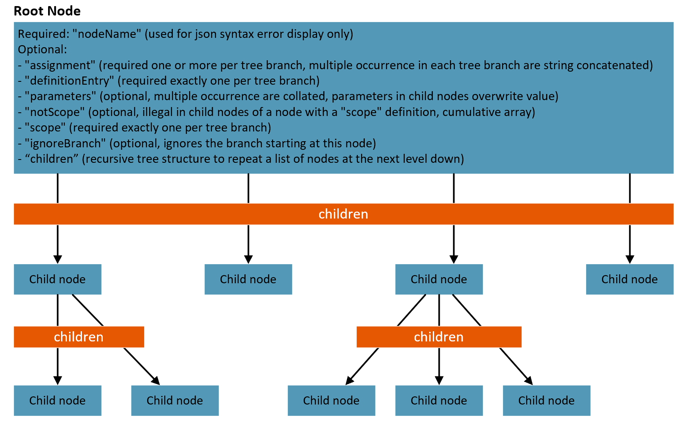

# Policy Assignments

This chapter describes how **Policy and Initiative Assignments** are handled by the Policy-as-Code framework. To learn about how custom Policy and Initiative definitions are managed, see the **[Definitions](Definitions.md)**  section.

The components required for **creating / updating / deleting Policy assignments and Policy set (initiative) assignments** are the following:

| Component | What is it used for? | Where can it be found? |
|--|--|--|
| **Assignment JSON files** | The assignments JSON file follows the management group hierarchy (optionally including subscriptions and resource groups) and defines all policy and initiative assignments on these scopes. | `Definitions/Assignments` folder |
| **Global Settings File** | The `global-settings.jsonc` file specifies common values for Policy Assignments  |`Definitions` folder |

## Scenarios

The Policy as Code framework supports the following Policy and Initiative assignment scenarios:

- **Centralized approach**: One centralized team manages all policy and initiative assignments in the Azure organization, at all levels (Management Group, Subscription, Resource Group).
- **Distributed approach**: Multiple teams can also manage policy and initiative assignments in a distributed manner if there's a parallel set Management Group hierarchies defined. In this case individual teams can have their own top level Management group (and corresponding Management Groups hierarchy with Subscriptions and Resource Groups below), but assignments must not be made on the Tenant Root Group level.
  > **NOTE**: Distributed teams must only include those scopes in their version of the assignments.json that is not covered by another team.
- **Mixed approach**: A centralized team manages policy and initiative assignments to a certain level (top-down approach), e.g. on the Tenant Root Group level, and top level Management group, and all assignments on lower levels (i.e. lower level Management Groups, Subscriptions and Resource Groups) are managed by multiple teams, in a distributed manner.

 **NOTE**: This solution enforces a centralized approach. It is recommended that you follow a centralized approach however, when using the mixed approach, scopes that will not be managed by the central team should be excluded from the assignments JSON file - therefore the assignment configuration script will ignore these scopes (it won't add/remove/update anything in there). At the same time, the distributed teams must only include those scopes in their version of the assignments.json that is not covered by the central team.

 <br/>[Back to top](#policy-assignments)<br/>

## Global Settings Configuration File

The `global-settings.jsonc` file is located in the `Definitions` folder and defines settings for all policy as code deployments with the following items:

- Managed Identity Locations
  - In this file, you must specify the locations for managed identities. This can be done for the entire platform by using the "*" operator or it can be specified on an environment level.
  - Typically this will be set to your primary tenant location
- Not Scope
  - Not Scope is designed to act as a permanent exclusion from policy evaluation. As opposed to an exemption which has a set end date. This can also be set across the entire platform or at an environment level.

```json
{
    "managedIdentityLocation": {
        "*": "eastus2"
    },
    "notScope": {
        "*": [
            "/resourceGroupPatterns/DefaultResourceGroup*"
        ],
        "PAC-PROD": [
            "/providers/Microsoft.Management/managementGroups/ExcludedMG",
            "/providers/Microsoft.Management/managementGroups/AnotherExcludedMG"
        ]
    }
    /* "notScope" Instructions
        Formats of array entries:
            managementGroups:      "/providers/Microsoft.Management/managementGroups/myManagementGroupId"
            subscriptions:         "/subscriptions/00000000-0000-0000-000000000000"
            resourceGroups:        "/subscriptions/00000000-0000-0000-000000000000/resourceGroups/myResourceGroup"
            resourceGroupPatterns: No wild card or single * wild card at beginning or end of name or both; wild card in middle is invalid
                                   "/resourceGroupPatterns/name"
                                   "/resourceGroupPatterns/name*"
                                   "/resourceGroupPatterns/*name"
                                   "/resourceGroupPatterns/*name*"
    */
}
```

<br/>[Back to top](#policy-assignments)<br/>

## Assignment File Overview Diagram

<br/>



<br/>[Back to top](#policy-assignments)<br/>

## Assignment JSON file structure

`scope` and `notScope` use an `AssignmentSelector` to specify which scope to use for diferrent environments and tenants. The value for the `AssignmentSelector` is passed to the build script as a parameter. A start matches any `AssignmentSelector` specified.

  ```json
{
    "nodeName": "NodeOneName",
    "parameters": {
        "GlobalParameterOne": [
            "TestValue"
        ]
    },
    "children": [
        {
            "nodeName": "ChildNodeName",
            "scope": {
                "PAC-DEV-001": [
                    "Specified scope such as: '/subscriptions/123456-1234-1234-123456789"
                ],
                "PAC-DEV-002": [
                    "Specified scope such as: '/subscriptions/123456-1234-1234-123456789"
                ],
                "PAC-TEST": [
                     "Specified scope such as: '/subscriptions/123456-1234-1234-123456789"
                ],
                "PAC-PROD": [
                     "Specified scope such as: /providers/Microsoft.Management/managementGroups/<managementGroupId>"
                ]
            },
            "children": [
                {
                    "nodeName": "nodeName",
                    "assignment": {
                        "name": "Assignment Name",
                        "displayName": "Assignment Display Name",
                        "description": "Assignment Description"
                    },
                    "definitionEntry": {
                        "policyName": "Reference to Initiative or Policy being assigned",
                        "friendlyNameToDocumentIfGuid": "Human friendly name of policy or initiative"
                    },
                    "parameters": {
                        "Local Parameter such as 'Effect'": "Deny"
                    },
                    "children": [
                        {
                            "nodeName": "NodeOne",
                            "assignment": {
                                "name": "AssignmentOne",
                                "displayName": "Display Name",
                                "description": "Description"
                            },
                            "parameters": {
                                "Lowest Level Local Parameter": "Value"
                            }
                        },
                        {
                            "nodeName": "NodeTwo",
                            "assignment": {
                                "name": "AssignmentTwo",
                                "displayName": "Display Name",
                                "description": "Description"
                            },
                            "parameters": {
                                "Lowest Level Local Parameter": "Value"
                            }
                        }
                        
                    ]
                },
                
            ]
        },
        {
            "nodeName": "NodeTwoName",
            "definitionEntry": {
                "policyName": "Reference to Initiative or Policy being assigned",
                "friendlyNameToDocumentIfGuid": "Human friendly name of policy or initiative",
                "roleDefinitionIds": [
                    "Role definitions needed. For example: b24988ac-6180-42a0-ab88-20f7382dd24c"
                ]
            },
            "assignment": {
                "name": "Assignment Name",
                "displayName": "Display Name",
                "description": "Description of assignment"
            },
            "parameters": {
                "Local Parameter such as 'Effect'": "Deny"
            },
            "children": [
                {
                    "nodeName": "NodeOne",
                    "assignment": {
                        "name": "Assignment Name",
                        "displayName": "Assignment Display Name",
                        "description": "Assignment Description"
                    },
                    "parameters": {
                        "Lowest Level Local Parameter": "Value"
                    },
                    "scope": {
                        "PROD": [
                            "Desired scope such as: /providers/Microsoft.Management/managementGroups/12345678901234567890"
                        ]
                    }
                },
                {
                    "nodeName": "NodeTwo",
                    "assignment": {
                        "name": "Assignment Name",
                        "displayName": "Display Name",
                        "description": "Display Name"
                    },
                    "parameters": {
                        "Lowest Level Local Parameter": "Value"
                    },
                    "scope": {
                        "PROD": [
                            "Desired scope such as: /providers/Microsoft.Management/managementGroups/12345678901234567890"
                        ]
                    }
                }
            ]
        }
    ]
} 
```

<br/>

## Assignment File Compnents

| Key | Description | Rule |
|-----|-------------|------|
| `nodeName` | abitray name of the node to used by the scripts to pinpoint format errors, | Must exist in each node. |
| `scope` | List of scopes for assigment. | Must exist excatly once in each branch of the tree. |
| `notScope` | List of notScopes. | Cumulative in branch. May not appear at a child node once the scope has been determined. |
| `assignment` | Assignment `name`, `displayName` and `description`. | Strig values are conctenated in each branch. |
| `parameters` | Parmeter values for the assignment. Specified paramters not defined in the assigned Policy or Initiative are silently ignored. | Union of all the parameters defined in a branch. Parameters redefined at a child (recursive) node overwrite the parent nodes value. |
| `ignoreBranch` | Ignore the rest of the tee staring at this node. Can be used to define future assignments without deploying the assignments. | Any node. |
| `enforcementMode` | Similar to `ignoreBarnch`, it deploys the assignment and sets the assignment to `Default` or `DoNotEnforce`. `DoNotEnforce` allows a whatif analysis. | Any node. |
| `definitionEntry` | Specifies the `policyName` or `initiativeName` for the assignment. The name should not be a fully qualified `id`. `friendlyNameToDocumentIfGuid` is purely used as a comment to make the Json more redable if the name is a GUID. | Must exist excatly once in each branch of the tree. |

<br/>[Back to top](#policy-assignments)<br/>

## Details for `scope` and `notScope` Values

### Using the `AssignmentSelector`

The assignment selctor determines the array being selected for this run of the script (e.g., `PAC-DEV-001`, `PAC-DEV-002`, `PAC-TEST` and, `PAC-PROD` above). Exact matches to the parameter `AssignmentSelector` for `Build-AzPoliciesInitiativesAssignmentsPlan.ps1` select that array for `notScope` and `scope`. A star (`*`) in the assignment or globalSettings.jsonc file  always selcts the array independent of the `AssignmentSelector`. The star is only useful in single tenant scenarios, except for R Group patterns.

### Resource Group patterns in `notScope`

`notScopes` also accept Resource Group name patterns with wild cards. Standard `notScope` definitions require fully qaulified paths. This solution can add Resource Groups based on name patterns. The pattern are resolved during deployment. Any Resource Group added after the deployment are not automatically added. You must reun the deployment pipeline to add new Resource Groups.

### Example Scope Definition

| Scope | Example |
|---|---|
| Management group | `/providers/Microsoft.Management/managementGroups/<managementGroupId>` |
| Subscription | `/subscriptions/<subscriptionId>` |
| Resource Group | `/subscriptions/<subscriptionId>/resourceGroups/<resourceGroupName>` |

<br/>[Back to top](#policy-assignments)<br/>

## Next steps

**[Policy and Initiative Definitions](Definitions.md)** <br/>
**[Pipeline Details](Pipeline.md)** <br/>
**[Deploy, Test and Operational Scripts](Scripts.md)** <br/>
<br/>[Return to the main page](../README.md)
<br/>[Back to top](#policy-assignments)<br/>
