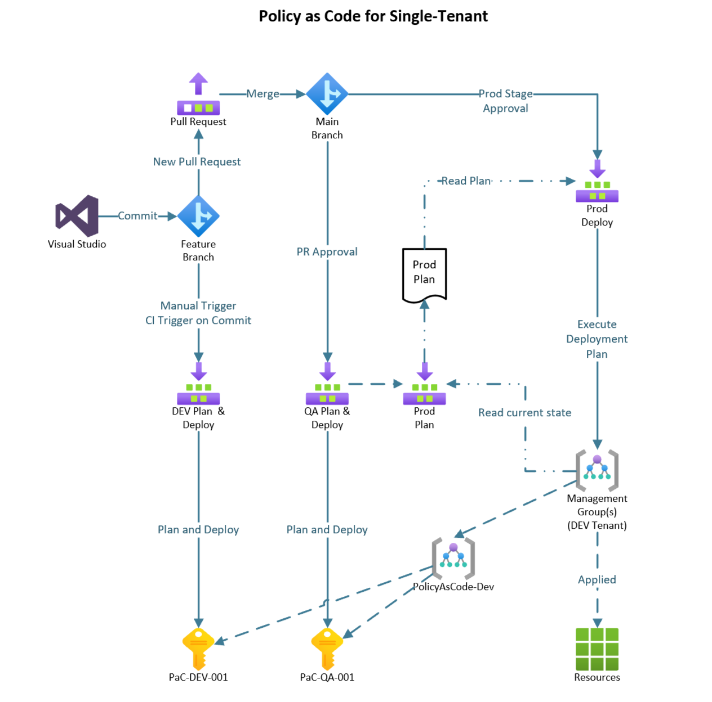
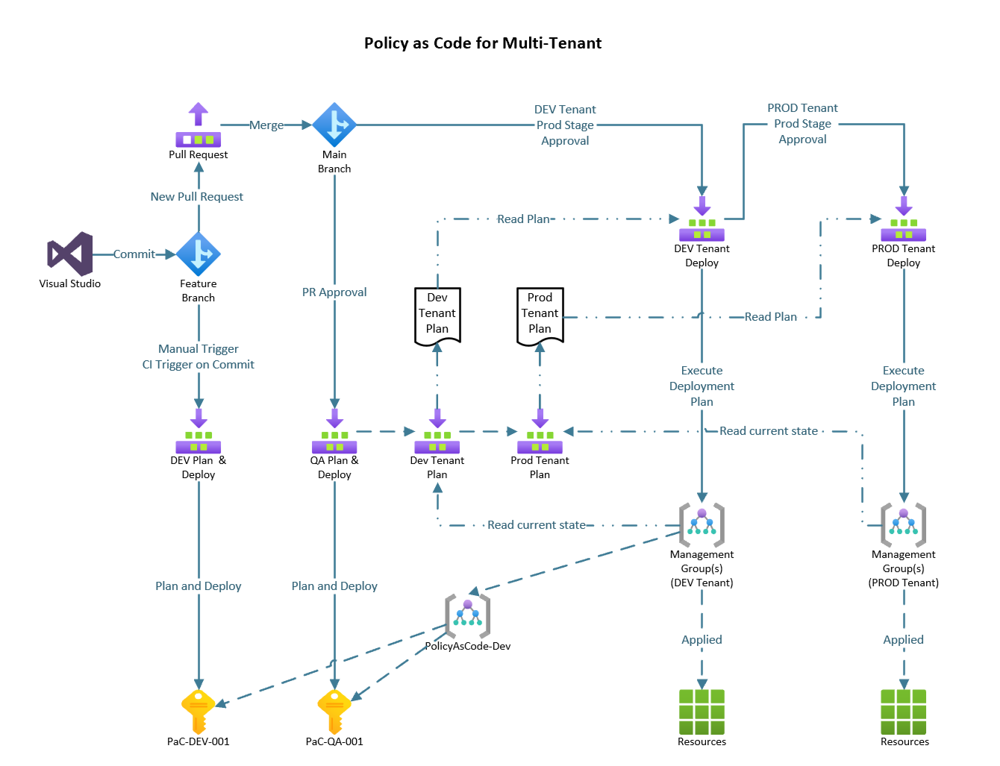
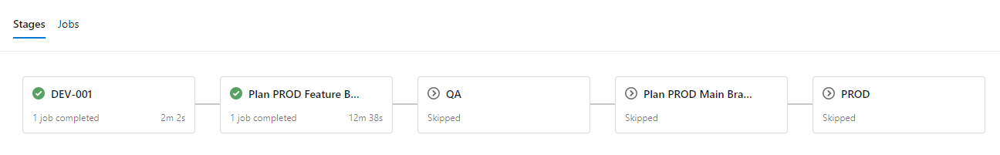
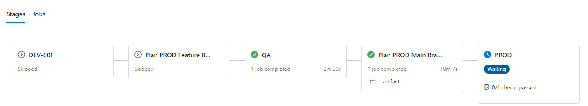
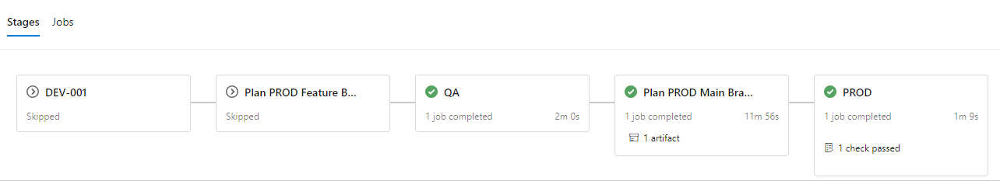

# Pipeline Operations

This article of the Policy as Code documentation contains all of the necessary information to configure, run and operate the deployment pipeline properly.

This repository contains pipleine definitions for Azure DevOps. **The authors are interested ins upporting other deployemnt pipelines. If you have developed pipelines for other technologies, such as GitHub, Jenkins, ...**

Pipeline definition for a single tenat with or without Role Assignments separated into an additional stage to enable a second approval. Two tenant scenario will arrive soon.

* Pipeline for single tenant deployment without Role Assignments separated into an additional stage `pipeline-single.yml`
* Pipeline for multi tenant deployment with Role Assignments separated into an additional stage to enable a second approval `pipeline-separate-roles.yml`

Piplines require configuration for your specific Azure environment. The piplelines can also be modified to provide different flows.

## Pipeline Stages

| Stage | Usage | Branch | Purpose | Environments |
| :--- | :--- | :------- | :--- | :--- |
| DEV  | Required | feature | CI | PAC-DEV-001 subscription
| PROD Plan CI | CI: optional   PR: recommneded | feature | CI and/or   PR Condition | Tenants' root or top-level   Management Group |
| TEST | Recommended | main | PR approved | PAC-TEST-001 |
| PROD Plan CD | Required | main | Plan PROD deployment | Tenants' root or top-level   Management Group |
| PROD Deploy | Required | main | Deploy to PROD   Plan role assignments   Opt: stage per tenant   Opt: Modify role assignments   Opt: Export roles | Tenants' root or top-level   Management Group |
| ROLES | Required or   Ext roles process | main | Modify role assignments   Opt: stage per tenant | Tenants' root or top-level   Management Group |

 [Back to top](#pipeline-operations) 

## Service Connections and Roles

If you have a single tenant, remove the last column and rows with connections ending in "-2".

| Connection | Stages  | PAC-DEV-001 | PAC-TEST-001 | Tenant 1 | Tenant 2 |
| :--- | :--- | :--- | :--- | :--- | :--- |
| sc-dev | DEV  | Owner
| sc-test    | TEST || Owner
| sc-plan-1 | PROD Plan CI   PROD Plan CD ||| Policy Reader   AAD Reader
| sc-plan-2 | PROD Plan CI   PROD Plan CD |||| Policy Reader   AAD Reader
| sc-prod-1 | PROD Deploy ||| Policy Contributor   AAD Reader
| sc-prod-2 | PROD Deploy |||| Policy Contributor   AAD Reader
| sc-uadmin-1 | PROD Roles ||| User Admin
| sc-uadmin-2 | PROD Roles |||| User Admin

 [Back to top](#pipeline-operations) 

## Components

The components required for **configuring the pipeline and deploying policies, initiatives, and assignments** are the following:

| Component | What is it used for? | Where can it be found? |
|--|--|--|
| **Pipeline File** | The 'pipeline.yml' file is used to configure the deployment pipeline in Azure DevOps | In the `Pipeline` folder. |
| **Service Connections** | Service connections give the pipeline the proper permissions to deploy at desired Azure scopes | You must create these, refer to the following documentation:  <https://docs.microsoft.com/en-us/azure/devops/pipelines/library/service-endpoints?view=azure-devops&tabs=yaml> |
| **Desired Scope** | Desired scope is defined by your organization. It is recommended that you create 3 service connections (PROD, QA, DEV) | Refer to the quick start guide to see a breakdown of the recommended scopes to deploy to |
| **Deployment Scripts** | These scripts are used to deploy your policies, initiatives, and assignments to Azure | In the `Scripts` folder of this repository |

 [Back to top](#pipeline-operations) 

## Pipeline Flows

Many flows can be implemented. This solution provides (currently) one pipline as depicted in the diagrams below. We pplan to have a total of 4 pipline samples.

* Single Tenant
  * No approval gate for role assignments
  * Extra approval gate for role assignments
* Multi Teanant (2)
  * No approval gate for role assignments
  * Extra approval gate for role assignments

### Single Tenant

 

 [Back to top](#pipeline-operations) 

## Multi Tenant

 

 [Back to top](#pipeline-operations) 

## Configuring the pipeline

> **NOTE**: Before configuring the pipeline, you will need to create service connections.
You must edit the following items in the `pipeline.yml` file to align with your Azure environment

* tenantID such as `12345678-1234-1234-1234-123456789012`
* rootScope definitions per environment such as `/subscriptions/12345678-1234-1234-1234-123456789012` or `/providers/Microsoft.Management/managementGroups/12345678-1234-1234-1234-123456789012`
* Service connection names such as `Policy-as-Code-DEV-Connection`

 [Back to top](#pipeline-operations) 

## Operating the pipeline

The pipeline operates in three consecutive steps in order to deploy policies, initiatives and assignments. This pipeline consists of six different stages that are triggered on the following four conditions:

* Commit to feature branch OR manual pipeline run from feature branch
* Approval of a pull request OR manual pipeline fun from the main branch
* Final approval gate passing

See the logical flow of the pipeline below:

* Upon `commit to a feature branch or a manual pipeline run`, the pipeline will run the Dev stage and deploy to the Dev scope as configured in the pipeline file. It will also create an initial plan of what changes will occur. This plan output is designed to be used by the person approving the pull request to analyze what changes are happening.

* After the `pull request is approved`, the QA stage will begin. This will deploy to your defined QA scope automatically, but will NOT deploy to your defined prod scope until the `approval gate is passed`. The approval gate is typically configured so that it can only be approved by someone other than the person who approved the pull request. This is approved separately from the pull request.

* Once the QA stage has finished, the deployment is ready for the final approval gate. The final approver can analyze any changes during this interval. Once the `approval gate is passed` deployments to prod will begin.

 [Back to top](#pipeline-operations) 

## Next steps

**[Policy and Initiative Definitions](Definitions.md)**  
**[Policy Assignments](Assignments.md)**  
**[Pipeline Details](Pipeline.md)**  
**[Deploy, Test and Operational Scripts](Scripts.md)**  
 [Return to the main page](../README.md)
 [Back to top](#pipeline-operations) 
