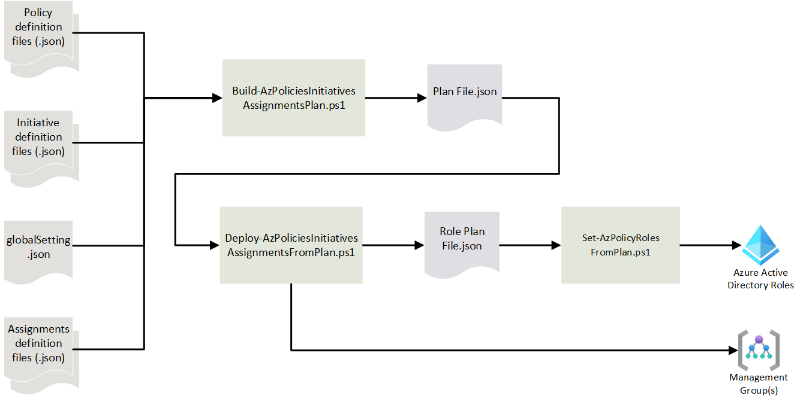

# Scripts

## Deployment Scripts

### Scripts per Stage

| Stage | Scripts |
| :--- | :--- |
| DEV  | Build-AzPoliciesInitiativesAssignmentsPlan.ps1 <br> Deploy-AzPoliciesInitiativesAssignmentsFromPlan.ps1 <br/> Deploy-AzRolesForRemediationTasks.ps1
| PROD Plan CI | Build-AzPoliciesInitiativesAssignmentsPlan.ps1
| TEST | Build-AzPoliciesInitiativesAssignmentsPlan.ps1 <br> Deploy-AzPoliciesInitiativesAssignmentsFromPlan.ps1 <br/> Deploy-AzRolesForRemediationTasks.ps1
| PROD Plan CD | Build-AzPoliciesInitiativesAssignmentsPlan.ps1
| PROD Deploy | Deploy-AzPoliciesInitiativesAssignmentsFromPlan.ps1
| PROD Role Assignment | Deploy-AzRolesForRemediationTasks.ps1

<br/>[Back to top](#scripts)<br/>

### Build-AzPoliciesInitiativesAssignmentsPlan.ps1

Analyzes changes in policy, initiative, and assignment file. It calculates a plan to apply deltas. The deployment scripts are **declarative** and **idempotent**: this means, that regardless how many times they are run, they always push all changes that were implemented in the JSON files to the Azure environment, i.e. if a JSON file is newly created/updated/deleted, the pipeline will create/update/delete the Policy and/or Initiative definition in Azure. If there are no changes, the pipeline can be run any number of times, as it won't make any changes to Azure.

In adddition to the [common parameters](#common-parmeters-for-flexible-and-unified-definitions), these parmeters are defined:

|Parameter | Required | Explanation |
|----------|----------|-------------|
| `TenantId` | Required | GUID for tenant |
| `RootScope` | Required | Specifies were Polici and Initiative definitions are created. For PaC developement is asubscription while PAC-PROD deployment use either the root teanant Management Group or the recommended single intermediary management Group. The scope must be a fully qualified. |
| `AssignmentSelector` | Required | String to select specifying the assignment scopes for this run. For details see [Policy Assignments](Assignments.md)  |
| `IncludeResource GroupsForAssignments` | Optional | Resource Group level assignements are not recommended; therefore, the script excludes Resource Groups from processing to save substantial execution time (tens of minutes to hours). This switch parameter overrides that default behavior. |
| `SuppressDeletes` | Optional | When using this switch, the script will NOT delete extraneous Policy definitions, Initiative definitions and Assignments. This can be useful for brown field deployments. |
| `PlanFile` | Optional | Plan output file (Json). It defaults to `./Output/Plans/current.json`. |
| `GlobalSettingsFile` | Optional | Global settings file path. It defaults to `./Definitions/global-settings.jsonc`. |
| `PolicyDefinitions` <br/> `RootFolder`| Optional | Root folder for Policy Definitions. It defaults to `./Definitions/Policies`. |
| `InitiativeDefinitions` <br/> `RootFolder` | Optional | Root folder for Initiative Definitions. It defaults to `./Definitions/Initiatives`. |
| `AssignmentsRootFolder` | Optional | Root folder for Assignment Files. It defaults to `./Definitions/Assignments`. |

<br/>[Back to top](#scripts)<br/>

### Deploy-AzPoliciesInitiativesAssignmentsFromPlan.ps1

Deploys policies, initiatives, and assignments at their desired scope based on the plan. It completes the role assignment plan.

|Parameter | Required | Explanation |
|----------|----------|-------------|
| `PlanFile` | Optional | Plan input file (Json). It defaults to `./Output/Plans/current.json`. |
| `RolesPlanFile` | Optional | Role Assignment Plan output file (Json). It defaults to `./Output/Plans/roles.json`. |

<br/>[Back to top](#scripts)<br/>

### Set-AzPolicyRolesFromPlan.ps1

Creates the role assignments for the Managed Identies required for `DeplyIfNotExists` and `Modify` Policies. .

### Flow

<br/>



<br/>[Back to top](#scripts)<br/>

## Operational Scripts

### CreateAzRemediationTasks.ps1

This script executes all remediation tasks in a Policy as Code environment specified with parameter `environmentSelector`. The script will interactively prompt for the value if the parameter is not supplied. The definition of the Management Groups and Subscriptions which define an environment are in [./Scripts/Config/Get-AzEnvironmentDefinitions.ps](#get-azenvironmentdefinitions_ps1). The script will recurse the Management Group structure and subscriptions from the defined starting point.

* Find all Policy assignments with potential remediations
* Query Policy Insights for non-complaint resources
* Start remediation task for each Policy with non-compliant resources

|Parameter | Required | Explanation |
|----------|----------|-------------|
| `environmentSelector` | Optional | Select the environment as defined in [./Scripts/Config/Get-AzEnvironmentDefinitions.ps](#get-azenvironmentdefinitions_ps1). The parameter is positional. If ommited, the script will interactively prompt for a value. |
| `suppressCollectionInformation` | Optional | Switch aparameter to suppress logging output about the collecting the Assignments. |
| `suppressCreateInformation` | Optional | Switch aparameter to suppress logging output about the creation of remediation tasks. |

<br/>[Back to top](#scripts)<br/>

### Get-AzEffectsForEnvironments.ps1

Creates a list with the effective Policy effects for the security baseline assignments per environment (DEV, DEVINT, NONPROD, PROD, etc.). The script needs the representative assignments defined for each environment in [./Scripts/Config/Get-RepresentativeAssignmnets.ps1](#Get-RepresentativeAssignmnets_ps1).

|Parameter | Required | Explanation |
|----------|----------|-------------|
| `outputPath` | Optional | Folder for the output file. It defaults to `./Output/AzEffects/Environments/`. |
| `outputType` | Optional | Specifies the output format <br/> `csv` is the deault and creates an Excel CSV file. <br/> `json` creates the same output as a JSON file. <br/> `pipeline` |

<br/>[Back to top](#scripts)<br/>

### Get-AzEffectsForInitiatives.ps1

Script calculates the effect paramters for the specified Initiative(s) outputing:

* Comparison table (csv) to see the differences between 2 or more initaitives (most useful for compliance Initiatives)
* List (csv) of default effects for a single initiative
* Json snippet with parameters for each initiative

|Parameter | Required | Explanation |
|----------|----------|-------------|
| `initiativeSetSelector` | Required | Specifies the initaitive set to compare from [./Scripts/Config/Get-InitiativesToCompare.ps1](#Get-InitiativesToCompare_ps1). |
| `outputPath` | Optional | Folder for the output files. It defaults to `./Output/AzEffects/Initiatives/`. |

<br/>[Back to top](#scripts)<br/>

### Get-AzResourceTags.ps1

Lists all resource tags in tenant.

|Parameter | Required | Explanation |
|----------|----------|-------------|
| `environmentSelector` | Optional | Select the environment as defined in [./Scripts/Config/Get-AzEnvironmentDefinitions.ps](#get-azenvironmentdefinitions_ps1). The parameter is positional. If ommited, the script will interactively prompt for a value. |
| `OutputFileName` | Optional | Output file name. |

<br/>[Back to top](#scripts)<br/>

### Get-AzMissingTags.ps1

Lists missing tags based on non-compliant Resource Groups.

|Parameter | Required | Explanation |
|----------|----------|-------------|
| `environmentSelector` | Optional | Select the environment as defined in [./Scripts/Config/Get-AzEnvironmentDefinitions.ps](#get-azenvironmentdefinitions_ps1). The parameter is positional. If ommited, the script will interactively prompt for a value. |
| `OutputFileName` | Optional | Output file name. |

<br/>[Back to top](#scripts)<br/>

### Get-AzStorageNetworkConfig.ps1

Lists Storage Account network configurations.

|Parameter | Required | Explanation |
|----------|----------|-------------|
| `environmentSelector` | Optional | Select the environment as defined in [./Scripts/Config/Get-AzEnvironmentDefinitions.ps](#get-azenvironmentdefinitions_ps1). The parameter is positional. If ommited, the script will interactively prompt for a value. |
| `OutputFileName` | Optional | Output file name. |

<br/>[Back to top](#scripts)<br/>

## Configuration Scripts

### Get-AzEnvironmentDefinitions.ps1

Script defines the environments which can be selected for opearional and test scripts. It is used by [Initialize-Environment.ps1](#initialize-Environment_ps1).

```ps
function Get-AzEnvironmentDefinitions {
    $tenantId = "11111111-2222-3333-4444-555555555555"
                "
    $environemts = @{
        prod = @{
            tenantId           = $tenantId
            rootScope          = "/providers/Microsoft.Management/managementGroups/11111111-2222-3333-4444-555555555555"
            scopeParam         = @{ ManagementGroupName = "11111111-2222-3333-4444-555555555555" }
            assignmentSelector = "PAC-PROD"
            planFile           = "./Output/Plans/prod-plan.json" 
            rolesPlan          = "./Output/Plans/prod-roles.json" 
        }
        test   = @{
            tenantId           = $tenantId
            rootScope          = "/subscriptions/11111111-2222-3333-4444-555555555555"
            scopeParam         = @{ SubscriptionId = "11111111-2222-3333-4444-555555555555" }
            assignmentSelector = "PAC-TEST"
            planFile           = "./Output/Plans/qa-plan.json" 
            rolesPlan          = "./Output/Plans/qa-roles.json" 
        } 
        dev = @{
            tenantId           = $tenantId
            rootScope          = "/subscriptions/11111111-2222-3333-4444-555555555555"
            scopeParam         = @{ SubscriptionId = "11111111-2222-3333-4444-555555555555" }
            assignmentSelector = "PAC-DEV-002"
            planFile           = "./Output/Plans/dev-plan.json" 
            rolesPlan          = "./Output/Plans/dev-roles.json" 
        } 
    }
    $defaultSubscriptionId = "11111111-2222-3333-4444-555555555555"

    # Put the hashtable into the pipeline
    $environemts, $defaultSubscriptionId
}
```

<br/>[Back to top](#scripts)<br/>

### Initialize-Environment.ps1

Script initializes the environment specific values for [Operational Scripts](#Operational-Scripts) and [Test Scripts](#Test-Scripts).

|Parameter | Required | Explanation |
|----------|----------|-------------|
| `environmentSelector` | Optional | Select the environment as defined in [./Scripts/Config/Get-AzEnvironmentDefinitions.ps](#get-azenvironmentdefinitions_ps1). The parameter is positional. If ommited, the script will interactively prompt for a value. |

<br/>[Back to top](#scripts)<br/>

### Get-RepresentativeAssignmnets.ps1

Script defines the representative Policy Assignments for a environement category (e.g., Sandbox, Dev, NonProd, Prod, ...) used by [Get-AzEffectsForEnvironments.ps1](#Get-AzEffectsForEnvironments_ps1).

```ps
$repAssignments = @{
    SANDBOX = @(
        "/providers/Microsoft.Management/managementGroups/mmmmmmm/providers/Microsoft.Authorization/policyAssignments/Azure Security Benchmark",
        "/providers/Microsoft.Management/managementGroups/mmmmmmm/providers/Microsoft.Authorization/policyAssignments/Org Delta - Sandbox"
    )
    DEV     = @(
        "/providers/Microsoft.Management/managementGroups/mmmmmmm/providers/Microsoft.Authorization/policyAssignments/Azure Security Benchmark",
        "/providers/Microsoft.Management/managementGroups/mmmmmmm/providers/Microsoft.Authorization/policyAssignments/Org Delta - NonProd"
    )
    NONPROD = @(
        "/providers/Microsoft.Management/managementGroups/mmmmmmm/providers/Microsoft.Authorization/policyAssignments/Azure Security Benchmark",
        "/providers/Microsoft.Management/managementGroups/mmmmmmm/providers/Microsoft.Authorization/policyAssignments/Org Delta - NonProd"
    )
    PROD    = @(
        "/providers/Microsoft.Management/managementGroups/mmmmmmm/providers/Microsoft.Authorization/policyAssignments/Azure Security Benchmark",
        "/providers/Microsoft.Management/managementGroups/mmmmmmm/providers/Microsoft.Authorization/policyAssignments/Org Delta - Prod"
    )
}
$rootScope = "/providers/Microsoft.Management/managementGroups/<guid>"
$envTagList = @( "SANDBOX", "DEV", "NONPROD", "PROD") # Hashtables to not preserve order. This orders the columns

$envTagList, $repAssignments, $rootScope
```

<br/>[Back to top](#scripts)<br/>

### Get-InitiativesToCompare.ps1

Script defines the Initiatives to process. It is used by [Get-AzEffectsForEnvironments.ps1](#Get-AzEffectsForInitiatives_ps1).

```ps
$initiativeSetsToCompare = @{
    NIST = @(
        "/providers/Microsoft.Authorization/policySetDefinitions/1f3afdf9-d0c9-4c3d-847f-89da613e70a8", # Azure Security Benchmark
        "/providers/Microsoft.Authorization/policySetDefinitions/179d1daa-458f-4e47-8086-2a68d0d6c38f", # NIST SP 800-53 Rev. 5
        "/providers/Microsoft.Authorization/policySetDefinitions/03055927-78bd-4236-86c0-f36125a10dc9"  # NIST SP 800-171 Rev. 2
    )
    ASB     = @(
        "/providers/Microsoft.Authorization/policySetDefinitions/1f3afdf9-d0c9-4c3d-847f-89da613e70a8"  # Azure Security Benchmark v3
    )
}
return $initiativeSetsToCompare
```

<br/>[Back to top](#scripts)<br/>

## Helper and Utility Scripts

The solution has many helper and utility scripts. list of key helpers:

| Script | Description |
|--------|-------------|
| Build-AzPolicyAssignment<br/>IdentityAndRoleChanges.ps1 | Calcuates the identity and Role assignment deltas. |
| Get-AssignmentDefs.ps1 | parses the Assignment definition files recursively to crete the definition driving the assignment creation. |
| Get-AzPolicyNotScope.ps1 | Calculates the effective `notScope` for both fully qualified `notScope` definitions and cakcuted `'notScope` based on a Resource Group pattern. |
| Get-AzScopeTree.ps1 | Multiple scripts require a complete understanding of the Mnagement Group tree structure, Subscriptions and Resource Groups. This script is used by multiple scripts to collect that tree. |
| Get-AzAssignmentsAtScope<br/>Recursive.ps1 | Finds all Policy and Roles Assignment from a given starting point recusively. Optionaly, It finds Initiative/Policy assignments requiring DeployIfNotExists and Modify remediation task. |

<br/>[Back to top](#scripts)<br/>

## Test Scripts

The test scripts are used to exercise deployment and helper scripts for debugging purposes. They simply invoke those scripts with the parameters set based on the optional `environmentSelector` parameter as defined in [./Scripts/Config/Get-AzEnvironmentDefinitions.ps](#get-azenvironmentdefinitions_ps1). The parameter is positional. If ommited, the script will interactively prompt for a value.

* Test-GetAzAssignments.ps1
* Test-BuildAzPoliciesInitiativesAssignmentsPlan.ps1
* Test-DeployAzPoliciesInitiativesAssignmentsFromPlan.ps1
* Test-SetAzPolicyRolesFromPlan.ps1

<br/>[Back to top](#scripts)<br/>

## Next steps

**[Policy and Initiative Definitions](Definitions.md)** <br/>
**[Policy Assignments](Assignments.md)** <br/>
**[Pipeline Details](Pipeline.md)** <br/>
<br/>[Return to the main page](../README.md)
<br/>[Back to top](#scripts)<br/>
