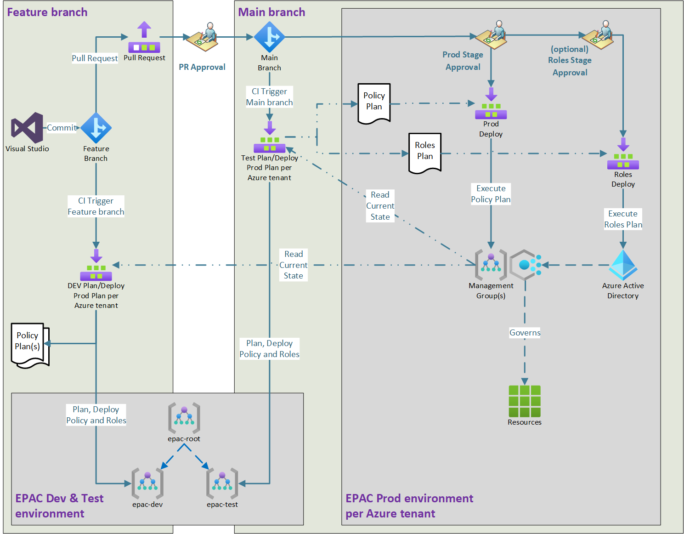
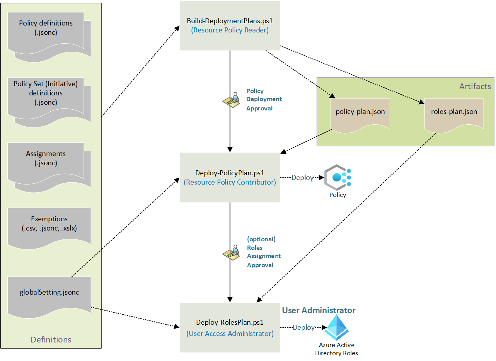
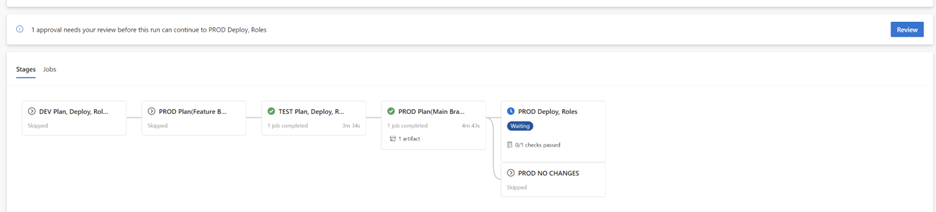
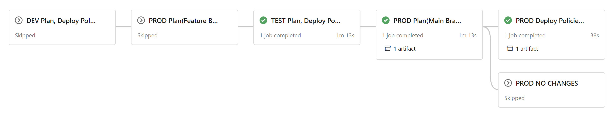
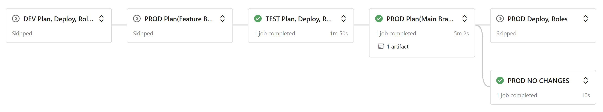

# Pipeline

This repository contains starter pipeline definitions for Azure DevOps. **The authors are interested in supporting other deployment pipelines. If you have developed pipelines for other technologies, such as GitHub, Jenkins, ...**

## Table of Contents

- [Components](#components)
- [GitHub Flow for Policy as Code Flows](#github-flow-for-policy-as-code-flows)
- [Single Tenant Pipeline Stages with Role Separation](#single-tenant-pipeline-stages-with-role-separation)
- [Service Connections and Roles](#service-connections-and-roles)
- [Deployment Scripts for Pipeline](#deployment-scripts-for-pipeline)
- [Scripts per Stage](#scripts-per-stage)
  - [Script Flow](#script-flow)
  - [Common Script Parameters](#common-script-parameters)
  - [Build-DeploymentPlans.ps1](#build-deploymentplansps1)
  - [Deploy-PolicyPlan.ps1](#deploy-policyplanps1)
  - [Deploy-RolesPlan.ps1](#deploy-rolesplanps1)
- [Consuming Excel Files](#consuming-excel-files)
- [Pipeline Execution](#pipeline-execution)
- [Reading List](#reading-list)

## Components

The components required for **configuring the pipeline and deploying policies, initiatives, and assignments** are the following:

| Component | What is it used for? | Where can it be found? |
|--|--|--|
| **Pipeline File** | The 'pipeline.yml' file is used to configure the deployment pipeline in Azure DevOps. | In the `Pipeline` folder. |
| **Service Connections** | Service connections give the pipeline the proper permissions to deploy at desired Azure scopes | Refer to the following documentation:  <https://docs.microsoft.com/en-us/azure/devops/pipelines/library/service-endpoints?view=azure-devops&tabs=yaml>. |
| **Deployment Environments** | Creates distinct environment to configure approval gates. | Refer to the following documentation:  <https://docs.microsoft.com/en-us/azure/devops/pipelines/process/environments?view=azure-devops>
| **Deployment Scripts** | These scripts are used by the pipeline to deploy your policies, initiatives, and assignments to Azure | In the `Scripts` folder of this repository |

## GitHub Flow for Policy as Code

The diagram below shows the use of GitHub Flow in Policy as Code. Builds are triggered for Commits, optionally for Pull Requests and for successful main branch merges.



## Single Tenant Pipeline Stages with Role Separation

| Stage | Purpose | Trigger |
|-------|---------|---------|
| devAllStage | Feature branch DEV environment build, deploy and test | CI, Manual |
| prodPlanFeatureStage | Feature branch based plan for prod deployment | CI, Manual |
| testAllStage | Main branch TEST environment build, deploy and test | PR Merged, Manual |
| prodPlanMainStage | Main branch based plan for prod deployment | PR Merged, Manual |
| prodDeployStage | Deploy Policies defined by Main branch based plan | Prod stage approved |
| prodRolesStage | Assign roles defined by Main branch based plan | Role stage approved |
| prodNoPolicyStage | Empty stage to display that no Policy changes are needed | No Policy changes needed |
| prodNoRoleStage | Empty stage to display that no Role changes are needed | No Policy changes needed |

## Service Connections and Roles

Create service connections for each of your environments and require minimum roles following the least privilege principle. If you have a single tenant, remove the last column and rows with connections ending in "-2".

| Connection | Stages  | PAC-DEV-001 | PAC-TEST-001 | Tenant 1 | Tenant 2 |
| :--- | :--- | :--- | :--- | :--- | :--- |
| sc-pac-dev | devAllStage  | Owner ||||
| sc-pac-test    | testAllStage || Owner |||
| sc-pac-plan-1 | prodPlanFeatureStage <br/> prodPlanMainStage ||| EPAC Policy Reader<br/>Security Reader ||
| sc-pac-plan-2 | prodPlanFeatureStage <br/> prodPlanMainStage |||| EPAC Policy Reader<br/>Security Reader |
| sc-pac-prod-1 | prodDeployStage-1 ||| Policy Contributor<br/>Security Reader ||
| sc-pac-prod-2 | prodDeployStage-2 |||| Policy Contributor<br/>Security Reader |
| sc-pac-roles-1 | prodRolesStage-1 ||| User Access Administrator<br/>Security Reader ||
| sc-pac-roles-2 | prodRolesStage-2 |||| User Access Administrator<br/>Security Reader |
| none | prodNoPolicyStage-1 <br/> prodNoRoleStage-1 <br/> prodNoPolicyStage-2 </br> prodNoRoleStage-2 |||||

> ---

## TBD Jeremiah: Document MS GRaph Permissions (may need to be separated out to a file do to its size -- images and all)

> ---

## Deployment Scripts for Pipeline

### Scripts per Stage

| Stage | Scripts |
| :--- | :--- |
| devAllStage  | Build-DeploymentPlans.ps1 <br> Deploy-PolicyPlan.ps1 <br/> Deploy-RolesPlan.ps1
| prodPlanFeatureStage | Build-DeploymentPlans.ps1
| testAllStage | Build-DeploymentPlans.ps1 <br> Deploy-PolicyPlan.ps1 <br/> Deploy-RolesPlan.ps1
| prodPlanMainStage | Build-DeploymentPlans.ps1
| prodDeployStage | Deploy-PolicyPlan.ps1
| prodRolesStage | Deploy-RolesPlan.ps1

### Script Flow



### Common Script Parameters

|Parameter | Required | Explanation |
|----------|----------|-------------|
| `PacEnvironmentSelector` | Optional | Selects the tenant, rootScope, defaultSubscription, assignment scopes/notScope and file names. If omitted, interactively prompts for the value. |
| `DefinitionsRootFolder` | Optional | Definitions folder path. Defaults to environment variable `$env:PAC_DEFINITIONS_FOLDER` or `./Definitions`. It contains `global-settings.jsonc`.

### Build-DeploymentPlans.ps1

Analyzes changes in policy, initiative, and assignment files. It calculates a plan to apply deltas. The deployment scripts are **declarative** and **idempotent**: this means, that regardless how many times they are run, they always push all changes that were implemented in the JSON files to the Azure environment, i.e. if a JSON file is newly created/updated/deleted, the pipeline will create/update/delete the Policy and/or Initiative definition in Azure. If there are no changes, the pipeline can be run any number of times, as it won't make any changes to Azure.

In addition to the [common parameters](#common-parameters-for-flexible-and-unified-definitions), these parameters are defined:

|Parameter | Required | Explanation |
|----------|----------|-------------|
| `IncludeResource GroupsForAssignments` | Optional | Resource Group level assignments are not recommended; therefore, the script excludes Resource Groups from processing to save substantial execution time (tens of minutes to hours). This switch parameter overrides that default behavior. |
| `SuppressDeletes` | Optional | When using this switch, the script will NOT delete extraneous Policy definitions, Initiative definitions and Assignments. This can be useful for brown field deployments. |
| `OutputFolder` | Optional | Output folder path for plan files. Defaults to environment variable `$env:PAC_OUTPUT_FOLDER` or `./Output`. |
| `PlanFile` | Optional | Plan output filename. Defaults to `$OutputFolder/policy-plan-$PacEnvironmentSelector/policy-plan.json`. |

### Deploy-PolicyPlan.ps1

Deploys Policies, Initiatives, and Policy Assignments at their desired scope based on the plan. It completes the role assignment plan by adding needed Managed Identities.

|Parameter | Required | Explanation |
|----------|----------|-------------|
| `InputFolder` | Optional | Input folder path for plan files. Defaults to environment variable `$env:PAC_INPUT_FOLDER`, `$env:PAC_OUTPUT_FOLDER` or `./Output`. |
| `OutputFolder` | Optional | Output folder path for plan files. Defaults to environment variable `$env:PAC_OUTPUT_FOLDER` or `./Output`. |
| `PlanFile` | Optional | Plan input filename. Defaults to `$InputFolder/policy-plan-$PacEnvironmentSelector/policy-plan.json`. |
| `RolesPlanFile` | Optional | Role Assignment plan output filename. Defaults to environment variable `$OutputFolder/roles-plan-$PacEnvironmentSelector/roles-plan.json`. |

### Deploy-RolesPlan.ps1

Creates the role assignments for the Managed Identities required for `DeployIfNotExists` and `Modify` Policies.

|Parameter | Required | Explanation |
|----------|----------|-------------|
| `InputFolder` | Optional | Input folder path for plan files. Defaults to environment variable `$env:PAC_INPUT_FOLDER`, `$env:PAC_OUTPUT_FOLDER` or `./Output`. |
| `RolesPlanFile` | Optional | Role Assignment plan input filename. Defaults to `$InputFolder/roles-plan-$PacEnvironmentSelector/roles-plan.json`. |

## Consuming Excel Files

Exemptions and assignments can use JSON, CSV and Excel (.xlsx) files. Support for Excel files uses a third-party PowerShell module from the PowerShell Gallery. However, the StarterKit pipeline disables the use of .xslx files module (`Convert-XlsToCSV.ps1`) as this utilizes third party software, which may or may not be permissable in the deployed environment due to supply chain risk mitigation rules. This does not imply any such vulnerabilities exist, and the project can be reviewed for appropriateness for your environment at [ImportExcel on Github](https://github.com/dfinke/ImportExcel). You may enable it at your own risk by uncommenting the sections in each planning stage. The pipeline further mitigates the risk by executing this step without Azure credentials.

```yml
  - task: PowerShell@2
    displayName: Convert Excel (.xlsx) to CSV
    inputs:
      pwsh: true
      filePath: "Scripts/Deploy/Convert-XlsToCsv.ps1"
```

## Pipeline Execution

Upon `commit to a feature branch or a manual pipeline run`, the pipeline runs stage devAllStage to deploy Policies, Initiatives and Assignments to the PAC DEV environment. Second, it calculates the plan for PROD environment deployment based on the Feature branch. This plan is never executed. Instead the logs and if desired the artifact generated are used by the developer to verify the definition files and to determine if the code is ready for a Pull Request. The PR approver(s) will use the same input plus the source code changes to decide the PR approval or rejection.


After the `pull request is approved and merged`, the pipeline runs stage devAllStage to deploy Policies, Initiatives and Assignments to the PAC TEST environment. Second, it calculates the plan for PROD environment deployment based on the merged Main branch. This plan is executed in one or two stages. The pipeline stops for PROD gate(s) approval at this time. The logs and if desired the artifacts generated are used by the PROD gate(s) approver(s) to decide on the PROD stage approval(s) or rejection(s).

> **Note:** The pipeline stage which deploys to the TEST environment is intended to validate deployment of the integrated set of features that have been individually tested/deployed in the DEV environment prior to deployment to the area of the tenant where workloads exist for testing with the new policies.



Once the `approval gate is passed` deployments to PROD will begin. Depending on the configuration a second approval before role assignments will be configured.



If there are no changes, empty stage(s) are executed to explicitly show that no changes are needed. These stages do not need service connections or approvals.



> **Note:** By default, the pipeline triggers are configured to run automatically for updates in the following directories. If you are undertaking active development and testing, you may wish to modify these values to include your work area.

```yml
trigger:
  branches:
    include:
      - /*
  paths:
    include:
      - $(PAC_DEFINITIONS_FOLDER)
      - Pipeline
      - Scripts
    exclude:
      - Scripts/Operations
```

## Reading List

- [Pipeline - Azure DevOps](azure-devops-pipeline.md)
- [Update Global Settings](definitions-and-global-settings.md)
- [Create Policy Definitions](policy-definitions.md)
- [Create Policy Set (Initiative) Definitions](policy-set-definitions.md)
- [Define Policy Assignments](policy-assignments.md)
- [Define Policy Exemptions](policy-exemptions.md)
- [Documenting Assignments and Initiatives](documenting-assignments-and-policy-sets.md)
- [Operational Scripts](operational-scripts.md)
- **[Cloud Adoption Framework Policies](cloud-adoption-framework.md)**

**[Return to the main page](../README.md)**
