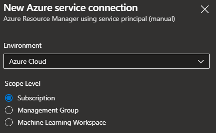
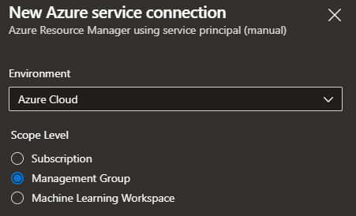
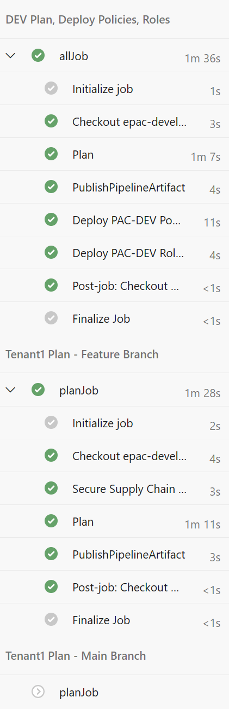
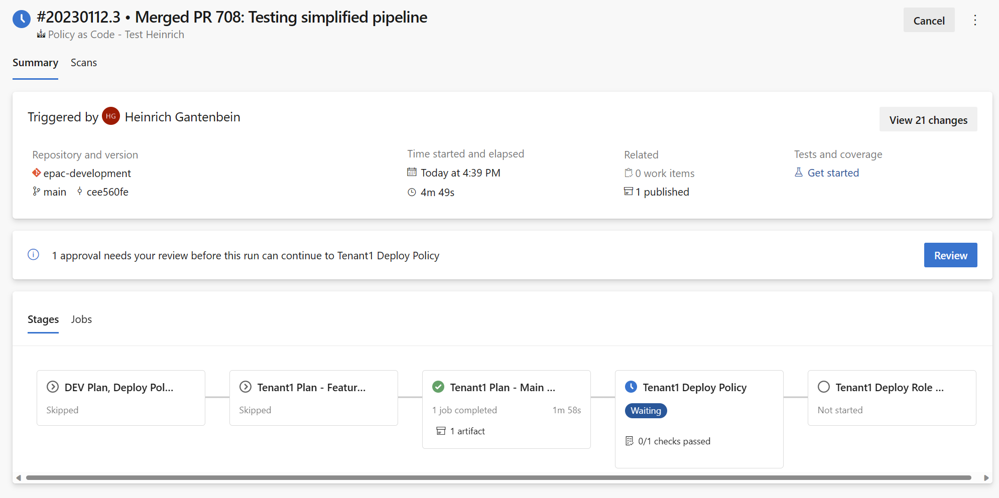

# Azure DevOps Pipelines

This page covers the specifics for Azure DevOps (ADO) pipelines. It si based on a simplified GitHub Flow as documented in [CI/CD Overview](./ci-cd-overview.md)

Previously [setup App Registrations](./ci-cd-app-registrations.md) are a pre-requisite.

This repository contains starter pipelines

* Azure DevOps (Single Tenant)
* Azure DevOps (Multi Tenant)
* Azure DevOps (Simplified)

## Service connections for Azure DevOps CI/CD

Create ADO service connections for each of the previously created [App Registrations](./ci-cd-app-registrations.md). You will need to retrieve the client id and create a client secret or authenticate with a X509 certificate configured for the SPN.

When creating a Service Connection in Azure DevOps you can set up the service connections on a Subscription or a Management Group scope level. If you are using subscriptions to simulate a hierarchy during EPAC development, configure the service connection(s) scope level as **Subscription**. When creating a Service Connections for management groups (any EPAC environments) Deployment and EPAC Role Assignment the service connection scope level is **Management Group**.

Subscription scope level | Management Group scope level
:-----------:|:----------------:
 | 

## Single Tenant Pipeline

### Single Tenant Stages

| Stage | Purpose | Trigger | Scripts |
|-------|---------|---------|---------|
| devStage | Feature branch DEV environment build, deploy and test | CI, Manual | Build-DeploymentPlans.ps1 <br> Deploy-PolicyPlan.ps1 <br/> Deploy-RolesPlan.ps1 |
| tenantPlanFeatureStage | Feature branch based plan for prod deployment | CI, Manual | Build-DeploymentPlans.ps1 |
| tenantPlanMainStage | Main branch based plan for prod deployment | PR Merged, Manual | Build-DeploymentPlans.ps1 |
| tenantDeployStage | Deploy Policies defined by Main branch based plan | Prod stage approved | Deploy-PolicyPlan.ps1 |
| tenantRolesStage | Assign roles defined by Main branch based plan | Role stage approved | Deploy-RolesPlan.ps1 |

### Single Tenant Service Connections and Roles

Create Service Principals and associated service connections in Azure DevOps or the equivalent in your CI/CD tool. The SPNs require the following roles to adhere to the least privilege principle. If you have a single tenant, remove the last column and rows with connections ending in "-2".

| Connection | Stages  | MG: epac-dev-mg | MG: Tenant Root |
| :--- | :--- | :--- | :--- |
| sc-pac-dev | devStage  | Owner <br/> MS Graph Permissions ||||
| sc-pac-plan | tenantPlanFeatureStage <br/> tenantPlanMainStage || EPAC Policy Reader <br/> MS Graph Permissions |
| sc-pac-prod | tenantDeployStage || Policy Contributor |
| sc-pac-roles | tenantRolesStage-1 || User Access Administrator <br/> MS Graph Permissions |

## Multi Tenant Pipeline

### Multi Tenant Stages

| Stage | Purpose | Trigger | Scripts |
|-------|---------|---------|---------|
| devStage | Feature branch EPAC DEV environment build, deploy and test | CI, Manual | Build-DeploymentPlans.ps1 <br> Deploy-PolicyPlan.ps1 <br/> Deploy-RolesPlan.ps1 |
| tenantPlanFeatureStage-1 | Feature branch based plan for prod deployment (tenant 1) | CI, Manual | Build-DeploymentPlans.ps1 |
| tenantPlanFeatureStage-2 | Feature branch based plan for prod deployment (tenant 2) | CI, Manual | Build-DeploymentPlans.ps1 |
| completedFeature | Empty stage to complete feature branch | None | None |
| tenantPlanMainStage-1 | Main branch based plan for prod deployment (tenant 1) | PR Merged, Manual | Build-DeploymentPlans.ps1 |
| tenantDeployStage-1 | Deploy Policies defined by Main branch based plan (tenant 1) | Prod stage approved | Deploy-PolicyPlan.ps1 |
| tenantRolesStage-1 | Assign roles defined by Main branch based plan (tenant 1) | Role stage approved | Deploy-RolesPlan.ps1 |
| tenantPlanMainStage-2 | Main branch based plan for prod deployment (tenant 2) | PR Merged, Manual | Build-DeploymentPlans.ps1 |
| tenantDeployStage-2 | Deploy Policies defined by Main branch based plan (tenant 2) | Prod stage approved | Deploy-PolicyPlan.ps1 |
| tenantRolesStage-2 | Assign roles defined by Main branch based plan (tenant 2) | Role stage approved | Deploy-RolesPlan.ps1 |

### Multi Tenant Service Connections and Roles

Create Service Principals and associated service connections in Azure DevOps or the equivalent in your CI/CD tool. The SPNs require the following roles to adhere to the least privilege principle. If you have a single tenant, remove the last column and rows with connections ending in "-2".

| Connection | Stages  | MG: epac-dev-mg | MG: Tenant 1 Root | MG: Tenant 2 Root |
| :--- | :--- | :--- | :--- | :--- |
| sc-pac-dev | devStage  | Owner <br/> MS Graph Permissions ||||
| sc-pac-plan-1 | tenantPlanFeatureStage-1 <br/> tenantPlanMainStage-1 || EPAC Policy Reader <br/> MS Graph Permissions ||
| sc-pac-plan-2 | tenantPlanFeatureStage-2 <br/> tenantPlanMainStage-2 ||| EPAC Policy Reader <br/> MS Graph Permissions |
| sc-pac-prod-1 | tenantDeployStage-1 || Policy Contributor ||
| sc-pac-prod-2 | tenantDeployStage-2 ||| Policy Contributor |
| sc-pac-roles-1 | tenantRolesStage-1 || User Access Administrator ||
| sc-pac-roles-2 | tenantRolesStage-2 ||| User Access Administrator |
| none | completedPlanFeatureStage ||||


## Azure DevOps (Simplified Pipeline)

If you have less complex requirements for a pipeline deployment using Azure DevOps you can utilize the ```simplified-pipeline.yaml``` file and the ```templates``` folder in the ```StarterKit``` folder to quickly get started in Azure Pipelines.

This template requires the creation of two environments in Azure Pipelines and can easily have approvals added for deployment control.

## Deployment Environments

Create distinct ADO environment to configure approval gates. Refer to the following documentation:  <https://docs.microsoft.com/en-us/azure/devops/pipelines/process/environments?view=azure-devops>


## Pipeline Execution

In Azure Devops pipelines the following happens. Your CI/CD tools will display progress differently.

### `Commit` to a feature branch or a manual pipeline run

* Stage devStage to deploy Policies, Policy Sets and Policy Assignments to the PAC DEV environment.
* Calculates the plan for PROD environment deployment based on the Feature branch.
  * This plan is never executed. Instead the logs and if desired the artifact generated are used by the developer to verify the definition files and to determine if the code is ready for a Pull Request.
  * The PR approver(s) will use the same input plus the source code changes to decide the PR approval or rejection.


Detail view:



### `Pull Request` is approved and branch merged into main

* Calculates the plan for PROD environment deployment based on the merged Main branch.
* The pipeline stops for PROD gate(s) approval at this time.
  * The logs and if desired the artifacts generated are used by the PROD gate(s) approver(s) to decide on the PROD stage approval(s) or rejection(s).
* 
* 
* After the approval deployments to PROD will begin.
* Optional a second approval before role assignments is required.
* 
* After the ntire run the overview page looks like this:
* 

### No changes

* Deployment steps and stages are skipped. Skipped stages do not need approvals.
* 
