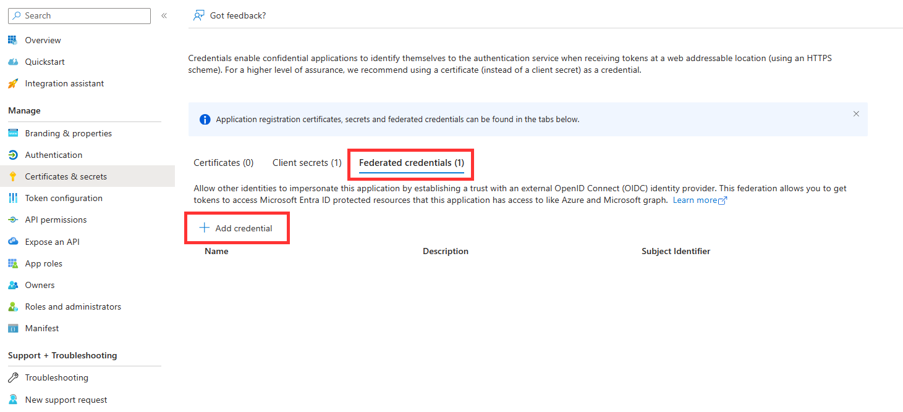
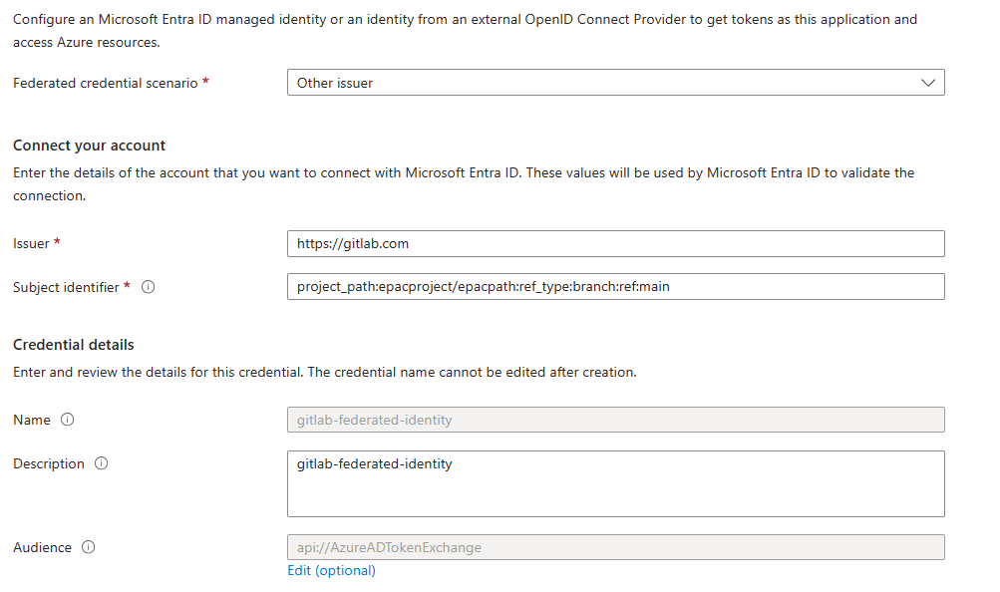

# App Registration & Service Principal Setup

The EPAC CI/CD pipelines/workflows utilize Entra ID (Azure AD) Service Principals as the identity to interact with your Azure environment. This section describes the recommended approach for utilizing service principals with EPAC. For general information on Service Principals, please review the [Microsoft Documentation](https://learn.microsoft.com/en-us/entra/identity-platform/app-objects-and-service-principals?tabs=browser)

> [!IMPORTANT]
> Please review the [EPAC Deployment Concepts](start-implementing.md/#epac-concepts-and-environments) before proceeding as the following guidance builds upon the EPAC Environment Construct

## Recommended Service Principals

To help maintain a segmentation of duties and a least-privilege approach, it is recommended to create separate service principals for each of the [general deployment steps](ci-cd-overview.md/#general-deployment-flow).

- Build Deployment Plans
    - A single service principal should be created for the plan steps across all EPAC environments. This Service Principal should be assigned the `Reader` Azure RBAC role at the Tenant Root.
    - **Note:** For Multi-Tenant environments, each tenant will need a Plan Service Principal.
- Policy Deployment (Per EPAC Environment)
    - Each EPAC Environment should have a separate service principal with the Azure RBAC Role `Resource Policy Contributor` assigned at the *EPAC environment root*. This Service Principal will be used for the policy deployment phase.
- Role Deployment (Per EPAC Environment)
    - Each EPAC Environment should have a separate service principal with the Azure RBAC Role `Role Based Access Control Administrator` assigned at the *EPAC environment root*. This service Principal will be used for the Azure RBAC role assignment phase.

> [!TIP]
> For the EPAC Development Environment, a single service principal can be used for both the Policy Deployment & Role Deployment to simplify management. While it is recommended to separate these to maintain a separation of duties and enable additional security controls, the nature and isolation of the EPAC Development environment does not create the need for separation. Note: If you wish to use a single Service Principal for EPAC Development, both role assignments are still required.

> [!TIP]
> To further improve security posture, conditions can be used for the RBAC assignment for each role deployment service principal to restrict the assignment of privileged roles such as `Owner`, `User Access Admin` and `Role Based Access Control Administrator`. In general, policy assignments should never require the use of an additional role assignment that will create other role assignments. For more information on conditions for role assignments, please refer to the [Azure RBAC Documentation](https://learn.microsoft.com/en-us/azure/role-based-access-control/conditions-format)

### Create Service Principals

For guidance creating Service Principals in Entra ID, please refer to the [Entra ID Documentation](https://learn.microsoft.com/en-us/entra/identity-platform/howto-create-service-principal-portal#register-an-application-with-microsoft-entra-id-and-create-a-service-principal

### Assign Service Principals Permissions in Azure

For guidance assigning Service Principals Azure RBAC roles, please refer to the [Azure RBAC Documentation](https://learn.microsoft.com/en-us/entra/identity-platform/howto-create-service-principal-portal#assign-a-role-to-the-application)

## Example Setup
Given the following screenshot of a Management Group hierarchy for Contoso.


Contoso has decided to utilize two EPAC Environments. One for EPAC Development (EPAC-Dev) and one for the remainder of their environment (Tenant), which has resulted the following global settings file:

```json
{
    "$schema": "https://raw.githubusercontent.com/Azure/enterprise-azure-policy-as-code/main/Schemas/global-settings-schema.json",
    "pacOwnerId": "{{guid}}",
    "pacEnvironments": [
        {
            "pacSelector": "epac-dev",
            "cloud": "AzureCloud",
            "tenantId": "{{tenant-id}}",
            "deploymentRootScope": "/providers/Microsoft.Management/managementGroups/epac-contoso"
        },
        {
            "pacSelector": "tenant",
            "cloud": "AzureCloud",
            "tenantId": "{{tenant-id}}",
            "deploymentRootScope": "/providers/Microsoft.Management/managementGroups/contoso"
        }
    ]
}
``` 

The following Service Principals & Role assignments would be created to support this structure:

| Service Principal | Azure Role Assignment | Assignment Scope |
| :--- | :--- | :--- |
| spn-epac-plan | Reader | Tenant Root Group |
| spn-epac-dev | Resource Policy Contributor <br> Role Based Access Control Administrator | epac-contoso |
| spn-epac-tenant-deploy | Resource Policy Contributor | Contoso |
| spn-epac-tenant-roles | Role Based Access Control Administrator | Contoso |

## Application Credentials

Credentials will need to be created for each Service Principal to be used in the CI/CD process. Traditionally, this is accomplished by creating a Client Secret on the associated Entra ID Application, and providing the CI/CD tool with the Application's ID and Secret. Secrets present an automation challenge as they need to be managed, secured, and rotated as they eventually expire. To solve this, some tools, including Azure DevOps, now support the use of Federated Credentials as described below.

### Azure Federated Identity Credentials

Federated identity credentials are a new type of credential that enables workload identity federation for software workloads. Workload identity federation allows you to access Microsoft Entra protected resources without needing to manage secrets (for supported scenarios).

Within your Registered App create a `Federated Credential`





(Example below is for a GitLab Implementation)


`Federated credential scenario` — List of supported Scenarios for leveraging Federated Credentials. 

`Audience` — The audience that can appear in the external token. This field is mandatory and should be set to `api://AzureADTokenExchange` for Microsoft Entra ID. It says what Microsoft identity platform should accept in the aud claim in the incoming token. This value represents Microsoft Entra ID in your external identity provider and has no fixed value across identity providers - you might need to create a new application registration in your IdP to serve as the audience of this token.

`Issuer` — The URL of the external identity provider. Must match the issuer claim of the external token being exchanged.

`Subject identifier` — The identifier of the external software workload within the external identity provider. Like the audience value, it has no fixed format, as each IdP uses their own - sometimes a GUID, sometimes a colon delimited identifier, sometimes arbitrary strings. The value here must match the sub claim within the token presented to Microsoft Entra ID.
