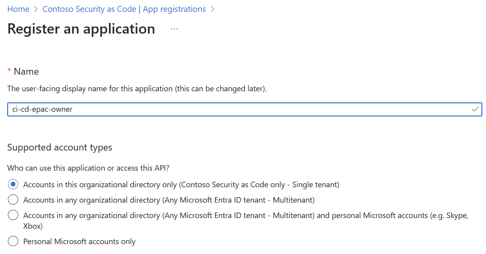
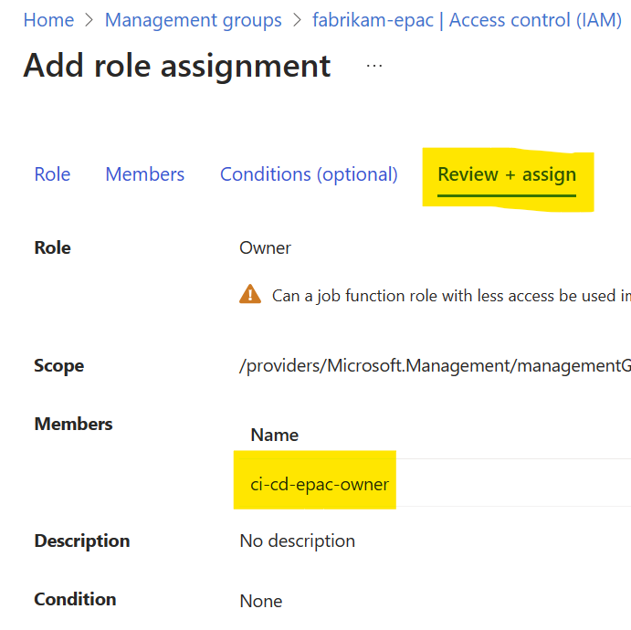

# App Registrations Setup

CI/CD pipelines/workflows require the creation of App Registrations in your Entra ID (Azure AD) tenants. The App Registrations are used by the EPAC pipeline to deploy the EPAC Management Group and the EPAC Management Group Policy Definitions.

The following screenshot shows the Management Group hierarchy that used for the App Registrations.


## Custom `EPAC Resource Policy Reader Role`

EPAC uses a set of Entra ID App Registrations (Service Principals). To build the deployment plan and adhere to the least-privilege-principle, a Resource Policy Reader role is required. This role is not built-in. EPAC contains script `New-AzPolicyReaderRole.ps1` to create this role or you can use the below JSON in Azure Portal.

```json
{
    "properties": {
        "roleName": "EPAC Resource Policy Reader",
        "description": "Provides read access to all Policy resources for the purpose of planning the EPAC deployments.",
        "assignableScopes": [
            "/"
        ],
        "permissions": [
            {
                "actions": [
                    "Microsoft.Authorization/policyassignments/read",
                    "Microsoft.Authorization/policydefinitions/read",
                    "Microsoft.Authorization/policyexemptions/read",
                    "Microsoft.Authorization/policysetdefinitions/read",
                    "Microsoft.PolicyInsights/*",
                    "Microsoft.Management/register/action",
                    "Microsoft.Management/managementGroups/read"
                ],
                "notActions": [],
                "dataActions": [],
                "notDataActions": []
            }
        ]
    }
}
```

## Create single App Registration and Role assignments for `epac-dev`

Create the App Registrations for:

- epac-dev environment with Owner rights to the epac-dev Management Group
- Optional: epac-test environment with Owner rights to the epac-test Management Group (repeat the steps below for epac-test)

### Create the App Registration for `epac-dev` environment



### Grant the App Registration the necessary Microsoft Graph permissions


### Grant the App Registration the necessary Azure `Owner` permissions for the epac Management Group





## Create App Registrations and Role assignments for prod environments (per tenant)

### App Registration  with permissions to read Policy resources and Azure roles

#### Create the App Registration the same as above with the same Microsoft Graph permissions


#### Create custom Azure role with permissions to read Policy resources


#### Grant the App Registration the custom Azure role at the root Management Group


### App Registration with permissions to deploy Policy resources

### Create the App Registration ***without*** Microsoft Graph permissions


#### Grant the App Registration the `ResourcePolicy Contributor` role at the root Management Group


### App Registration with permissions to assign Roles at root Management Group

#### Create the App Registration the same as above with the same Microsoft Graph permissions


#### Grant the App Registration the `User Access Administrator` role at the root Management Group


