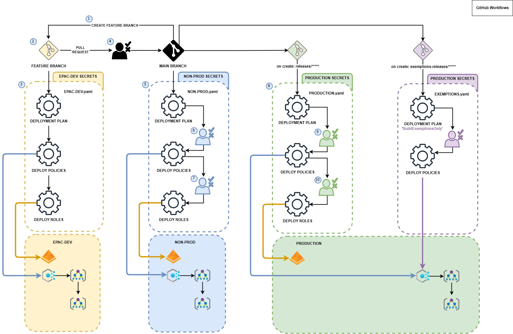

# Branching Overview
The following section covers two branching strategies for EPAC that are supported by the starter kits - `GitHub Flow` and `Release Flow`. Both strategies follow their respective general guidance as documented for [GitHub Flow](https://docs.github.com/en/get-started/using-github/github-flow), and [Release Flow](https://learn.microsoft.com/en-us/devops/develop/how-microsoft-develops-devops), however, the method you choose may be dependent on the EPAC environment structure you choose to use. In general, `GitHub Flow` is recommended for simple EPAC deployments that contain an EPAC Development Environment and a Main/Tenant Environment. If you wish to utilize multiple additional environments, and/or deploy to those environments in a staged/ring-based fashion (Deploy to Environment A then Deploy to Environment B), the `Release Flow` model may provide greater flexibility.

> [!IMPORTANT]
> Please review the [App Registrations Setup](ci-cd-app-registrations.md) for information on the permissions and Service Principals (SPNs) recommended for deployments.

## Develop Policy Resources in a Feature Branch

Developing Policy resources is the same for `GitHub Flow` and `Release Flow`. The following steps are recommended:

1. Developers create feature branches from `main` branch with a name `feature/*user-id*/*feature-name*`.
2. Developers create or update Policy definitions, Policy Set definitions, Policy Assignment, and Policy Exemptions files in the `Definitions` folder. Developers push changes to the feature branch.
3. A "Development" CI/CD pipeline/action is triggered from the push to the feature branch. This pipeline will perform the following steps:
    - Build Deployment Plans for the EPAC Development Environment (e.g. `EPAC-Dev`), showing any changes made.
    - Deploy Policy Plans to the EPAC Development Environment (e.g. `EPAC-Dev`), providing an end-to-end test in development and allowing developers to validate the changes.
    - Deploy Policy Roles to the EPAC Development Environment (e.g. `EPAC-Dev`) to create the role assignments for the Managed Identities required for any `DeployIfNotExists` and `Modify` Policies.
    - Build Deployment Plans for **all** remaining environments (e.g. `Prod`). This accounts for a "Shift-Left" deployment mindset and helps validate changes against the other environments to surface any potential issues as the change is rolled out past the EPAC Development environment. The Plans are stored in the `Output` folder.
4. When the feature is ready, the developer creates a Pull Request (PR) to merge the feature branch into the `main` branch.
5. Set the pull request to be auto completed. Ensure that you select `Delete feature/*user-id*/*feature-name* after merging`.

6. After the merge completes, cleanup your local clone by:
    - Switching the branch to main
    - Pull the latest changes from main
    - Delete the feature branch
    - Run `git remote prune origin` to remove the remote tracking branch.

Steps 1 to 3 are repeated during the development process. In both models, this helps ensure short lived feature branches, with a constant push to `main`, while providing a baseline validation of the change against all environments.

## Simplified `GitHub Flow` for Deployment

The diagram below shows the use of GitHub Flow in Policy as Code. The diagram uses GitHub workflow terminology; however, the concepts apply equally to other CI/CD technologies.

Once Development is completed, as noted above, the merge of the PR into the `main` branch triggers the CI/CD pipeline/action to deploy the changes to the main environment. The following steps are recommended:

- Build Deployment Plans for the Prod Environment (e.g. `Prod`), showing any changes made.
- Approval gate for Policy resources deployment.
- Deploy Policy Plans to the Prod Environment (e.g. `Prod`)
- Approval gate for Role assignments deployment.
- Deploy Policy Roles to the Prod Environment (e.g. `Prod`) to create the role assignments for the Managed Identities required for any `DeployIfNotExists` and `Modify` Policies.

### `GitHub Flow` Variations

EPAC can handle any flow you like. For `GitHub Flow`, the following variations are possible.

- Adding a deployment plan from the feature branch to the production environment in step 3 above during the development process (see steps 1 through 3 in the diagram above) by adding a step using Build-DeploymentPlans.ps1. This is useful to test the deployment plan in the production environment before creating a PR. We recommend using a separate SPN for this step (job).
- PR creation trigger for a CI/CD pipeline/action deploying the changes to an `epac-test` environment with the same steps as the deployment to `epac-dev` environment in steps 3 above.

## Advanced Deployment with Release Flow

In some cases, especially when using multiple EPAC Environments, it may be desirable to deploy the Policy changes in a ring-based model, deploying to one environment before deploying to all remaining environments. This can help limit risk and impact should an update cause unintended issues. While there are many ways to implement a ring-based deployment, the Release Flow branching strategy as described below, can be an effective model with EPAC. For the following, lets assume Contoso has three (3) EPAC environments, `EPAC-Dev`, `nonprod`, and `prod`. They wish to deploy all policy changes as soon as they are ready into the `nonprod` environment, while waiting to deploy to `prod` and batching deployments into larger "releases" once they are sure there are no impacts.

- Initial policy development follows the same process as outlined in [Develop Policy Resources in a Feature Branch](#develop-policy-resources-in-a-feature-branch) above.
- The merge of the PR into the `main` branch triggers a NonProd specific CI/CD pipeline/action to deploy the changes to the EPAC `nonprod` environment. This pipeline would follow the general deployment steps, but targeted only to the `nonprod` EPAC environment.
  - Build Deployment Plans for the nonprod Environment (e.g. `nonprod`), showing any changes made.
  - Approval gate for Policy resources deployment.
  - Deploy Policy Plans to the nonprod Environment (e.g. `nonprod`)
  - Approval gate for Role assignments deployment.
  - Deploy Policy Roles to the nonprod Environment (e.g. `nonprod`) to create the role assignments for the Managed Identities required for any `DeployIfNotExists` and `Modify` Policies.
- Wait to verify that the Policies in the EPAC `nonprod` environment are working as expected, and/or wait for additional policies/development cycles to finish.
  - Create a `releases-prod` branch to trigger a Prod specific CI/CD pipeline/action to deploy the changes to the EPAC `prod` environment. The pipeline would follow the same general deployment steps as the nonprod pipeline, but targeted to the `prod` EPAC environment.
  - Keep n-1 `releases-prod` branches to allow for quick rollback in case of issues.
- Sometimes, Exemptions need to be granted while keeping a regular lifecycle for Definitions and Assignments. To accomplish this, follow the general steps below:
  - The exemption should be committed to `main` through the standard development process. This is critical as it provides the standard development plans to run, ensures a code review, and guarantees the change is in `main` so it does not re-occur in future deployments
  - Once merged to `main` use the PR page to cherry-pick the changes into the active `releases-prod` branch, which creates a new pull request. This ensures traceability and allows for approval before the change is deployed. 
  - This process is documented in further detail on the [Microsoft Release Flow Documentation](https://learn.microsoft.com/en-us/devops/develop/how-microsoft-develops-devops#release-hotfixes)

### `Release Flow` Variations

EPAC can handle any flow you like. For `Release Flow`, the following variations are possible.

- Adding a deployment plan from the feature branch to the production environment in step 3 above during the development process (see steps 1 through 3 in the diagram above) by adding a step using Build-DeploymentPlans.ps1. This is useful to test the deployment plan in the production environment before creating a PR. We recommend using a separate SPN for this step (job).
- PR creation trigger for a CI/CD pipeline/action deploying the changes to an `epac-test` environment with the same steps as the deployment to `epac-dev` environment in steps 3 above.

## Multiple Tenants

For multiple tenants simply apply each of the flows (except for the `feature` branch) above to each tenant's EPAC environments. This works for both simplified GitHub flow and Microsoft Release flow.
