# GitLab DevOps Pipelines

This page covers the specifics for configuring GitLab DevOps pipelines. Pipelines can be further customized based on requirements. The guidance provided is for the simplified GitLab Flow, as documented in the [branching flows](ci-cd-branching-flows.md).

## Creating a New GitLab Project

Visit https://gitlab.com or your self-hosted GitLab instance. Log in with your credentials and click "New project" (typically on the dashboard or under the "Projects" menu). Select "Create blank project."

Fill in Project Details:
1. Project name: e.g., azure-terraform-deploy
2. Project slug: Auto-filled based on the name
3. Project description (optional): A short summary of the project
4. Visibility level:
   - Private – Only you and invited members can access
   - Internal – Only logged-in users can access
   - Public – Anyone can access
5. Click "Create project".

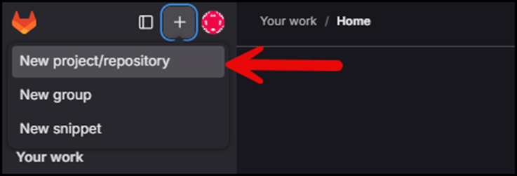

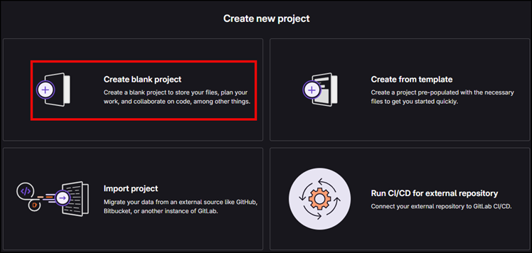

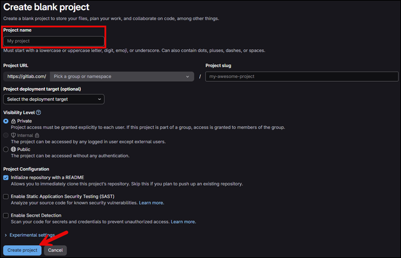

## Cloning the EPAC Repository

Visit GitLab and clone your repository. In GitLab, navigate to your project and click "Code," then click the "Copy URL" button under "Clone with HTTPS" as illustrated below. Navigate back to your local folder structure on your laptop. Once there, right-click and select "Open Terminal" as shown below. Once the terminal is open, make sure you are in the same directory/folder and clone the repository from GitLab. Clone the repository with the provided clone command "git clone https://gitlab.com/landing-zone4/your-project.git" (paste the copied Clone with HTTPS URL from GitLab). Once the clone process is complete, close this terminal. Open the cloned directory in VS Code. The same files from the GitLab repository are replicated to your local directory.

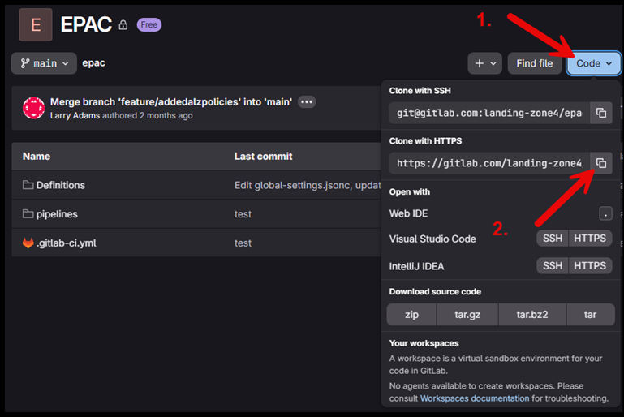

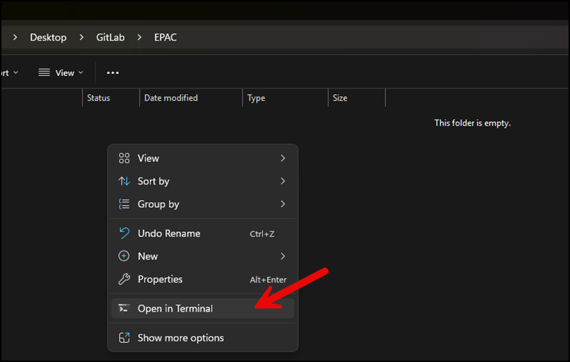

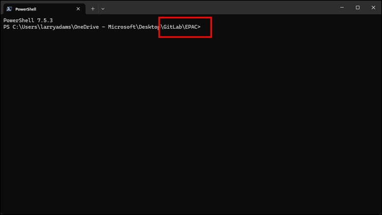

## Azure Service Principal OIDC Authentication Creation

Visit the Azure Portal, navigate to Entra ID, select App registrations, and click "Add New registration."

In the Name field, enter a name that clearly reflects the application's purpose, for example: epac_plan. Repeat this process two more times for Application/Service Principals epac_policy and epac_roles.

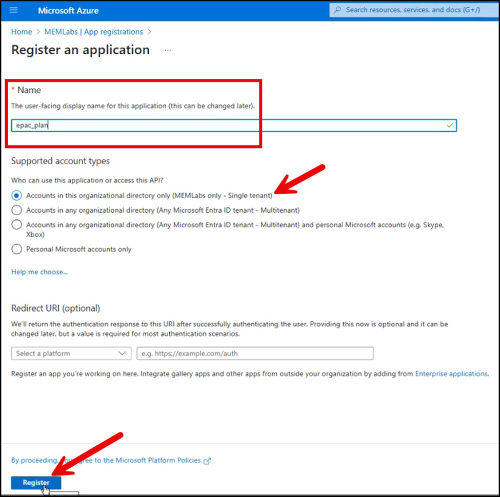

Once the Application/Service Principals have been created, they need to be given permissions. The following roles will be assigned:

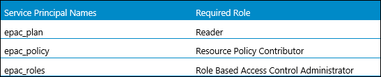

Navigate to Management Groups and click on the Tenant Root Group

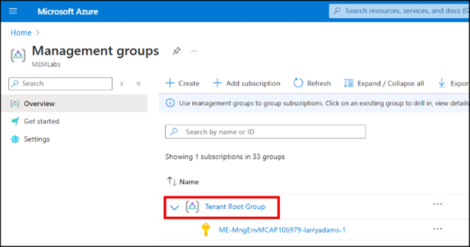

Click on "Access control (IAM)," then click on "Add role assignment."

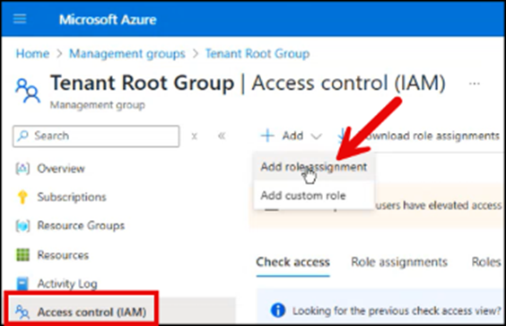

Select "Reader" and click "Next."

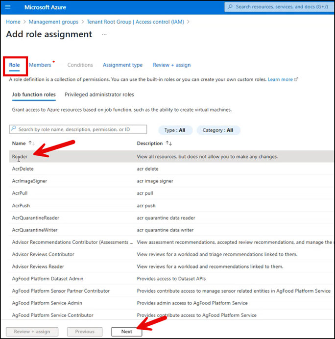

On the next screen, select "Members," search for your newly created service principal/application epac_roles, choose the service principal, click "Select," and then click "Review + assign."

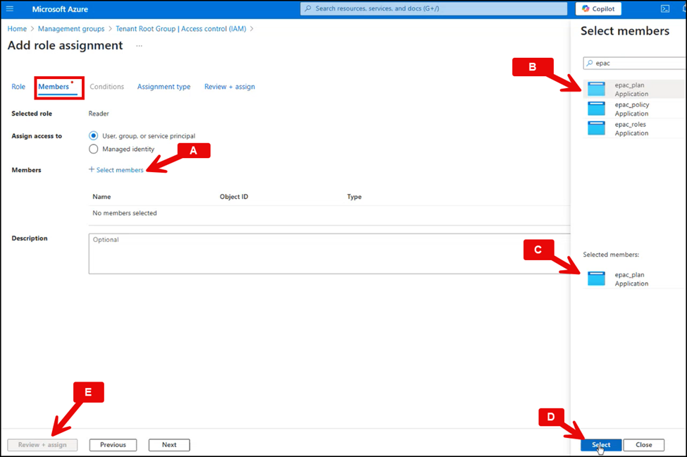

Navigate to Management Groups and click on the Tenant Root Group.

Click on "Access control (IAM)" and select "Add role assignment."

Search for "Resource Policy Contributor" and select "Next."

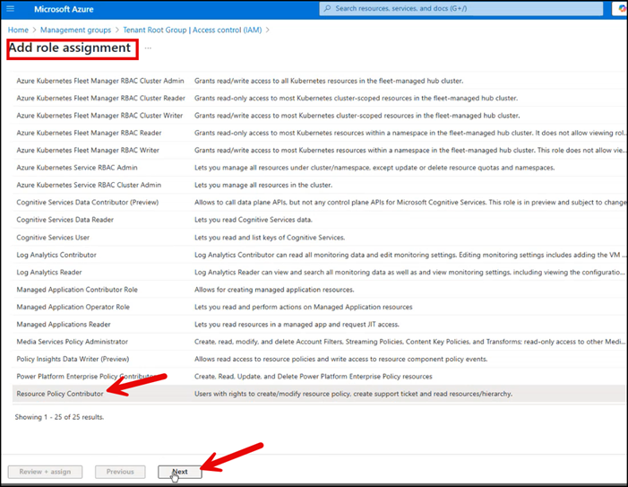

On the next screen, select "Members," search for your newly created service principal/application epac_roles, choose the service principal, click "Select," and then click "Review + assign."

Navigate to Management Groups and click on the Tenant Root Group.

Click on "Access control (IAM)" and select "Add role assignment."

Click on "Privileged administrator roles" and select "Role Based Access Control Administrator."

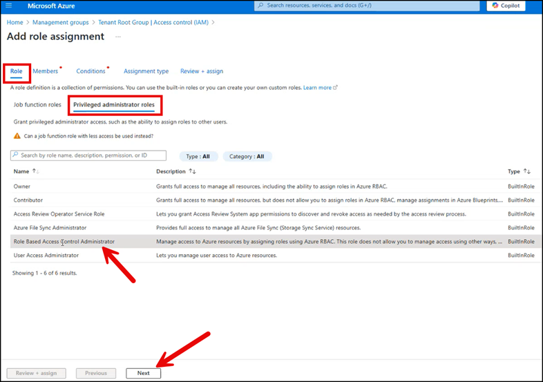

On the next screen, select "Members," search for your newly created service principal/application epac_roles, choose the service principal, click "Select," and then click "Review + assign."

Next, select "Conditions" and select "Allow user to assign all roles (highly privileged)," then select "Review and assign."

In the Azure Portal, navigate to Azure Active Directory > App registrations. Locate and select the newly created application from the list.
1. In the left-hand menu, click on "Certificates & secrets"
2. Then click on "Federated credentials"
3. Click "+ Add credential" to begin adding a new federated identity credential.

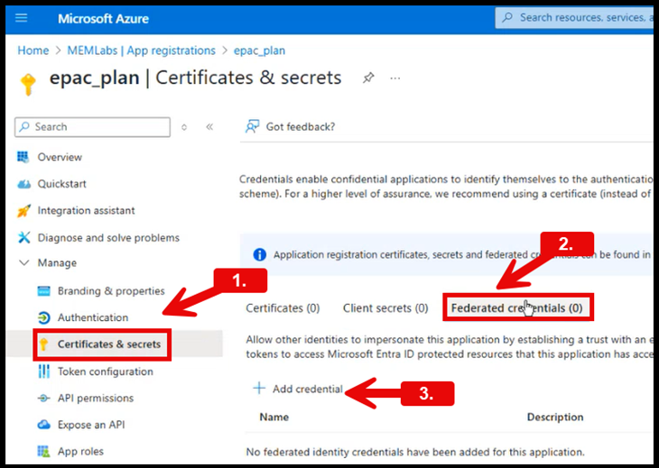

Federated Credential Scenario - Other issuer:
A. Issuer - https://gitlab.com & select "Claims matching expression"
B. Value - claims['sub'] matches 'project_path:(yourgitlabprojectpath):ref_type:branch:ref:*'
   (Follow the screenshots below for GitLab project path)
C. Name - gitlab-federated-identity
D. Description - gitlab-federated-identity
E. Audience - https://gitlab.com
F. Click "Add"

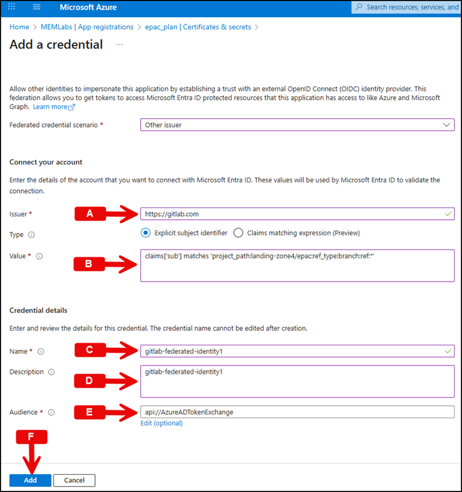

Navigate to your GitLab Projects page, click on the menu to the right of the respective project, and click "Edit."

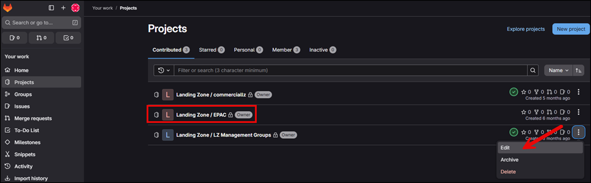

Scroll down and select "Advanced." Once in Advanced, scroll down and copy the path after .com/ (e.g., https://gitlab.com/<landing-zone4/epac>) to complete the above step.

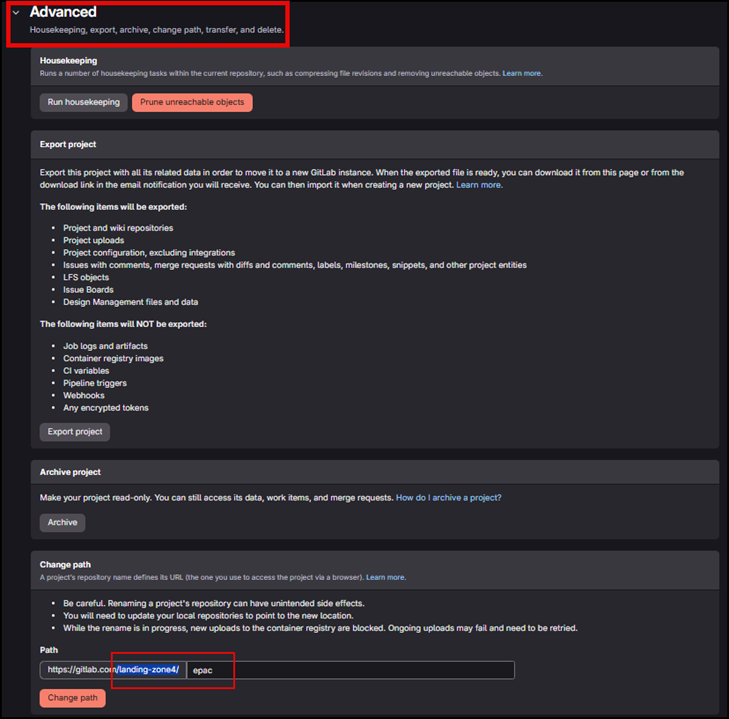

In Azure, navigate to Application Registrations, search for and select "epac," and copy the Application (Client) ID.

### GitLab CI/CD Variables Configuration

In GitLab, navigate to the project, go to the left-hand menu and click "Settings," then under Settings select "CI/CD," scroll down to the Variables section and click "Expand," and click "Add Variable" on the right side.

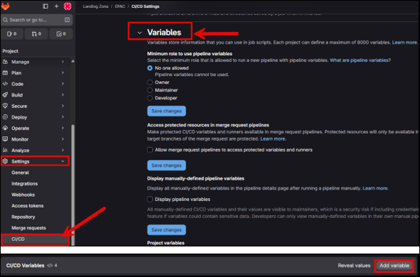

Navigate to your GitLab project, go to Settings > CI/CD, expand the Variables section, click "Add Variable," and enter AZURE_TENANT_ID in the Key field.

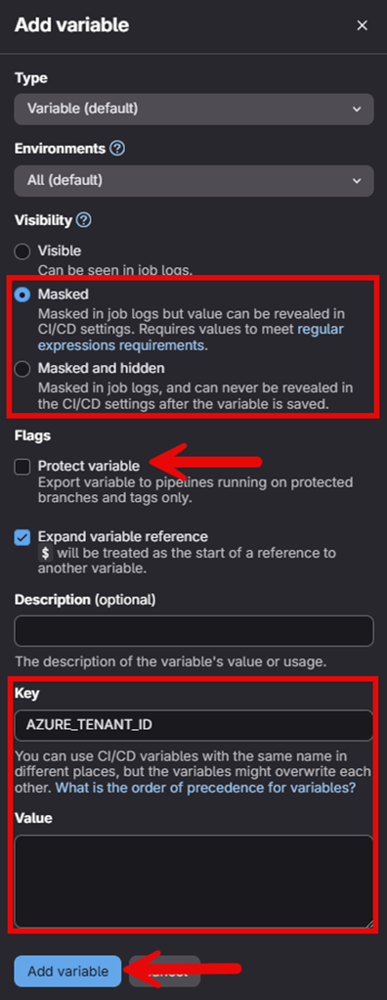

Open a new tab and log in to the Azure Portal. Locate and copy your Tenant ID (you can find it under Azure Active Directory > Overview).

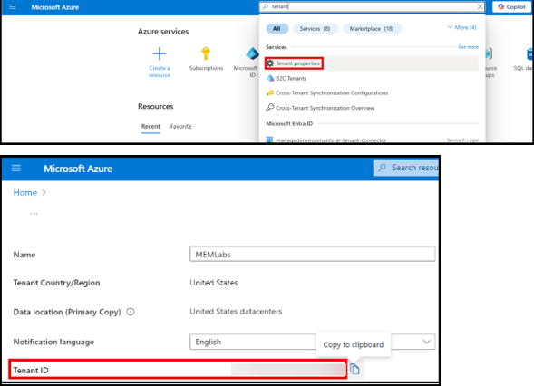

Return to GitLab, paste the Tenant ID into the Value field, check the box for "Masked," ensure the "Protect variable" option is not selected, and click "Add variable" to save.

In Azure, navigate to Application Registrations, search for and select "epac_plan," and copy the Application (Client) ID.

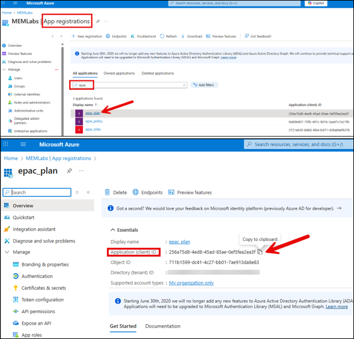

a. Navigate to your GitLab project and go to Settings > CI/CD
b. Expand the Variables section and click "Add Variable"
c. In the Key field, enter: epac_plan
d. In the Value field, paste the Application (Client) ID you copied from the Azure Portal
e. Under Visibility, check the box for "Masked"
f. Under Flags, ensure that "Protect variable" is not checked
g. Click "Add variable" to save
h. After saving, the Add Variable form will be reset and ready for the next variable

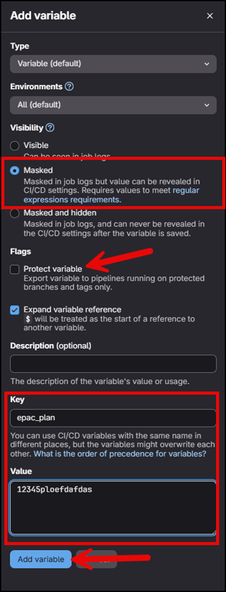

In Azure, navigate to Application Registrations, search for and select "epac_policy," and copy the Application (Client) ID.

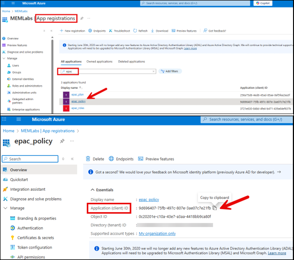

a. Navigate to your GitLab project and go to Settings > CI/CD
b. Expand the Variables section and click "Add Variable"
c. In the Key field, enter: epac_policy
d. In the Value field, paste the Application (Client) ID you copied from the Azure Portal
e. Under Visibility, check the box for "Masked"
f. Under Flags, ensure that "Protect variable" is not checked
g. Click "Add variable" to save
h. After saving, the Add Variable form will be reset and ready for the next variable

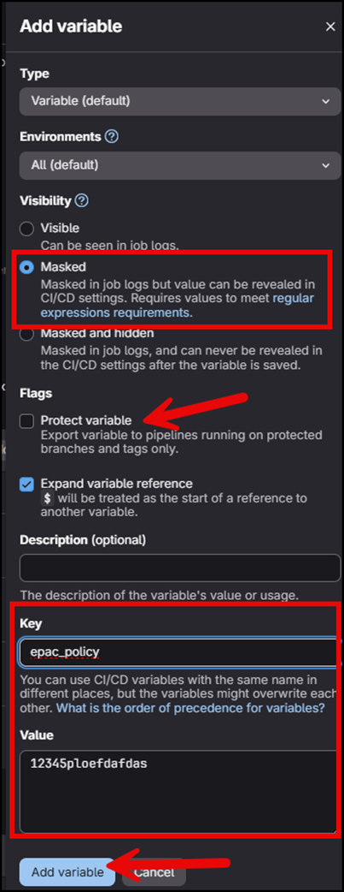

In Azure, navigate to Application Registrations, search for and select "epac_roles," and copy the Application (Client) ID.

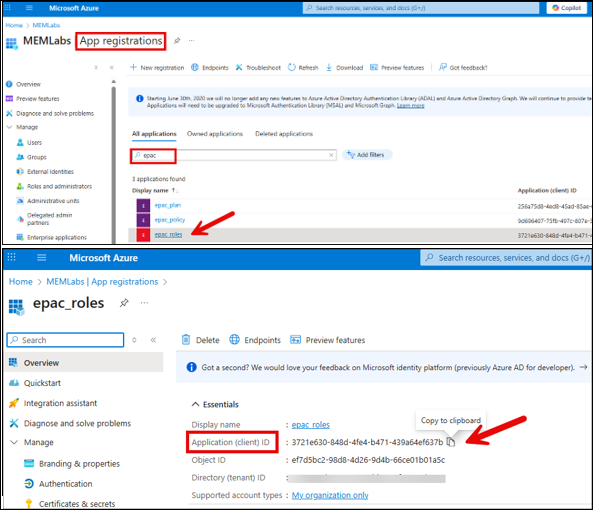

a. Navigate to your GitLab project and go to Settings > CI/CD
b. Expand the Variables section and click "Add Variable"
c. In the Key field, enter: epac_roles
d. In the Value field, paste the Application (Client) ID you copied from the Azure Portal
e. Under Visibility, check the box for "Masked"
f. Under Flags, ensure that "Protect variable" is not checked
g. Click "Add variable" to save
h. After saving, the Add Variable form will be reset and ready for the next variable

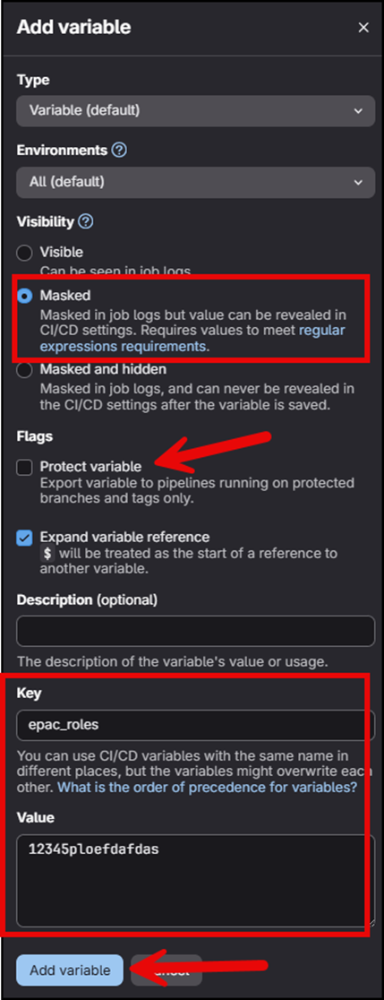

### Running the EPAC GitLab Pipeline

In GitLab, navigate to the project and go to the left-hand menu and select Build > Pipelines. 

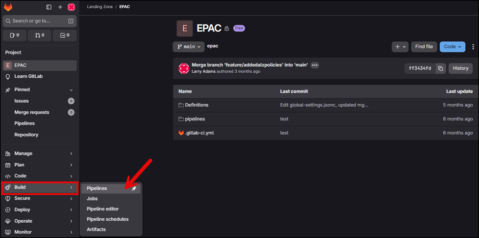

 On the top right, click "New pipeline." On the next screen, set the Value to "True" for the target environment, then click "New pipeline" again to start the deployment process.

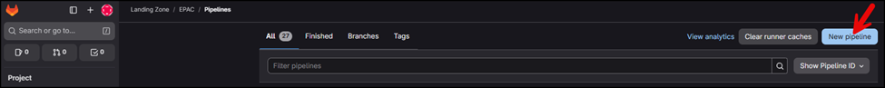

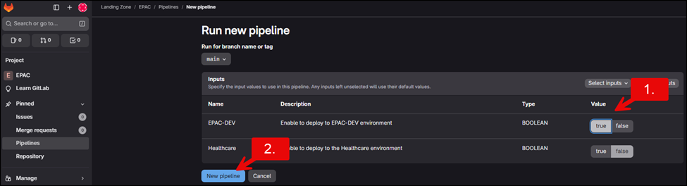

The pipeline will run through four stages, which were defined in the .gitlab-ci.yml file:
1. Validate - Checks syntax and structure
2. Deploy Plan - Shows what changes will be made. Make sure the output you receive is the output you are expecting
3. Deploy Policy - Policies and policy sets (initiatives) are deployed to the target environment
4. Deploy Roles - Deploys the necessary roles and permissions needed by the policy

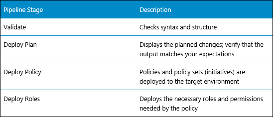

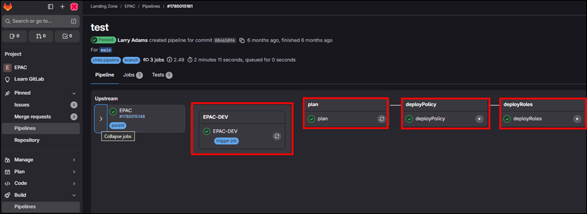

The stages will not run automatically as per best practices. Review the output of each stage to ensure the desired output has been achieved before executing the next stage. 

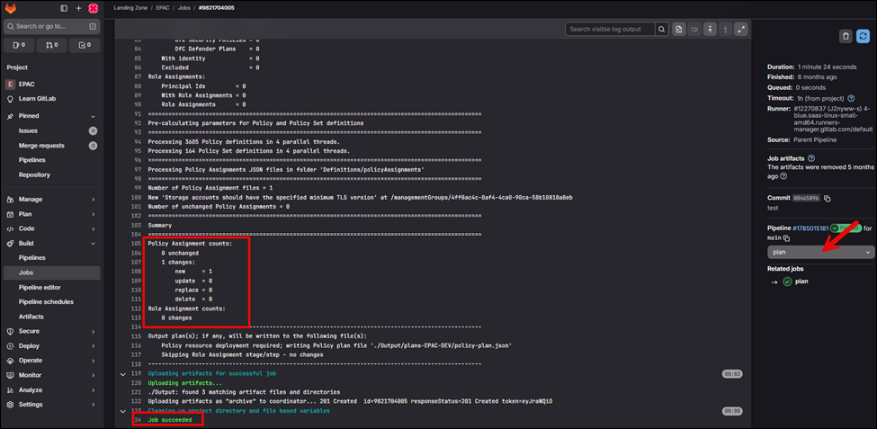

Deploy Plan - Shows what changes will be made. Make sure the output you receive is the output you expect.

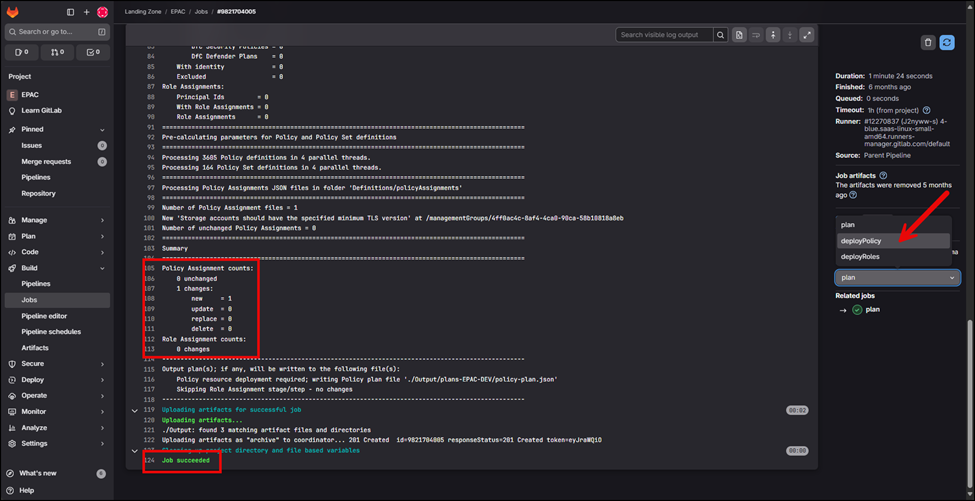

Deploy Policy - Policies and policy sets (initiatives) are deployed to the target environment.

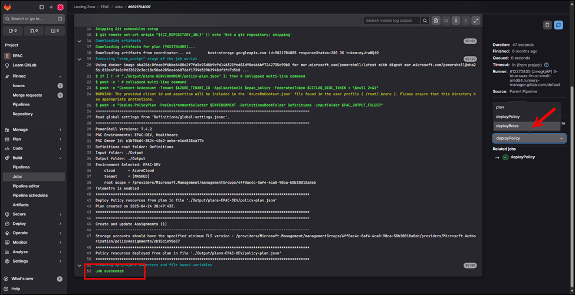

Deploy Roles - Deploys the necessary roles and permissions needed by the policy.

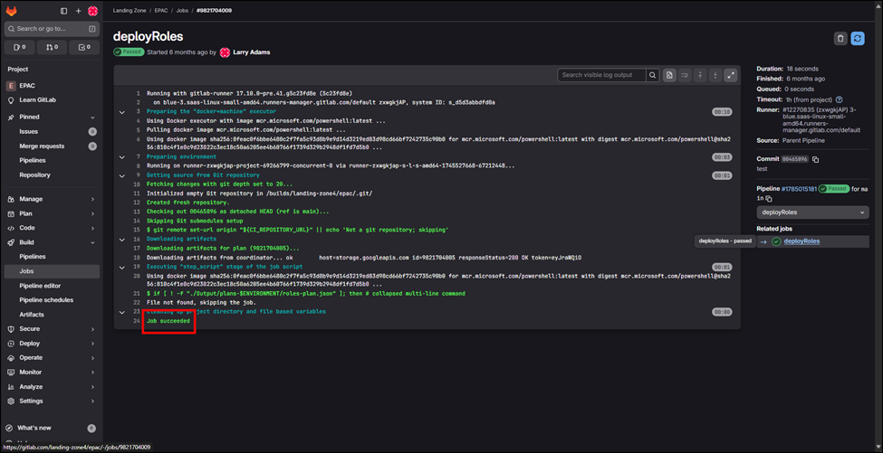

A successful deployment is indicated by three green checkmarks—one for each stage—confirming that you've completed the GitLab pipeline deployment.

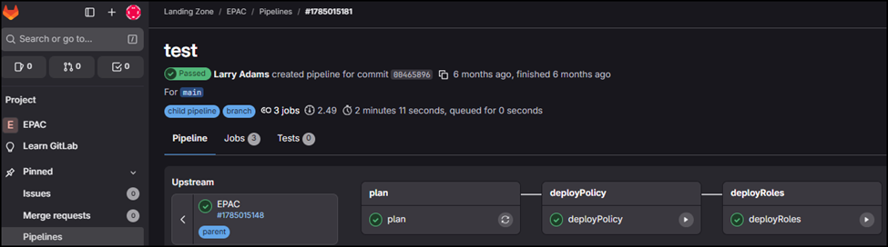
