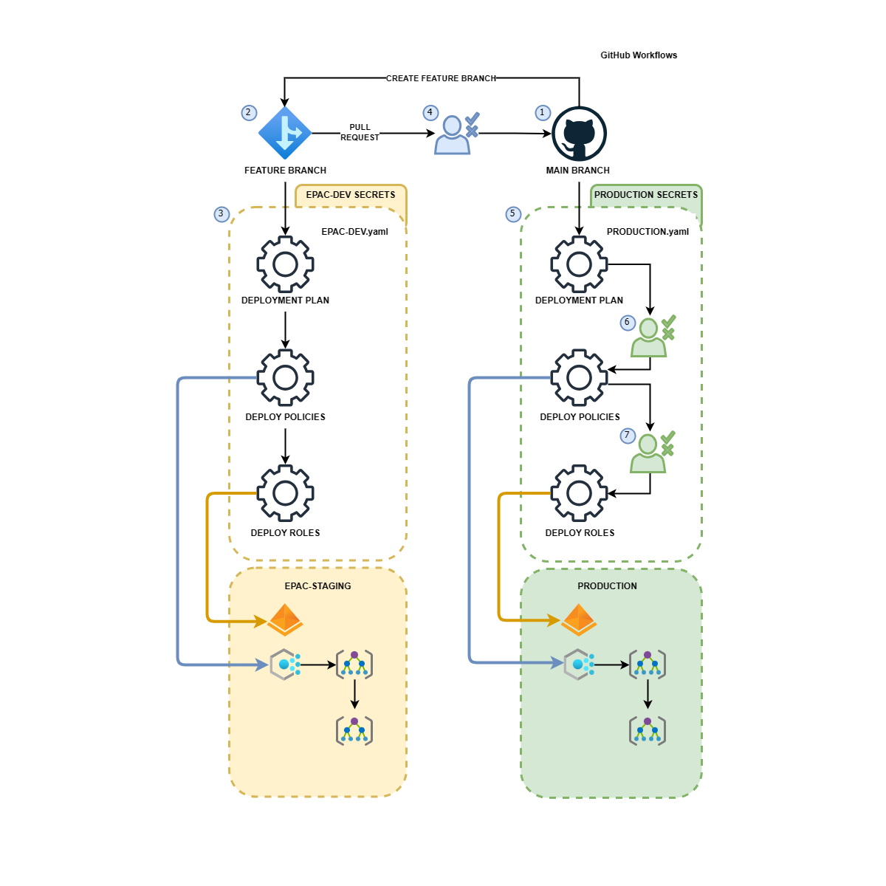

# CI/CD Overview
This page covers the general CI/CD documentation.

This repository contains starter pipelines

* [Azure DevOps Pipelines](./ci-cd-ado-pipelines.md)
* [GitHub Actions](./github-actions.md)

The authors are interested in supporting other deployment pipelines. If you have developed pipelines for other technologies, such as GitLab, Jenkins, etc., please contribute them to the project as additional starter kits.

## Simplified `GitHub Flow` for Policy as Code

The diagram below shows the use of GitHub Flow in Policy as Code. The diagram uses GitHub workflow terminology; however, the concepts apply equally to other CI/CD technologies. Detailed instructions for  [Azure DevOps Pipelines](./ci-cd-ado-pipelines.md) and [GitHub Actions](./github-actions.md) are provided.

The flow shown in the diagram contains the following steps:

1. Developers create feature branches from `main` branch.
2. Developers create or update Policy definitions, Policy Set definitions, and Policy Assignment files in the `Definitions` folder. Developers push changes to the feature branch.
3. The CI/CD pipeline/action is triggered from the push to the feature branch. We recommend to use a single App Registration (SPN) to execute pipeline/action. The SPN must have `Owner` rights to the `epac-dev` Management Group and the Microsoft Graph permissions described below. The steps are:
    * Build-DeploymentPlans.ps1 to calculate the deployment plan
    * Deploy-PolicyPlan.ps1 to deploy the plan's Policy Resources
    * Deploy-RolesPlan.ps1 to create the role assignments for the Managed Identities required for `DeployIfNotExists` and `Modify` Policies.
* Steps 1 to 3 are repeated during the development process.
4.  When the feature is ready, the developer creates a Pull Request (PR) to merge the feature branch into the `main` branch. The merge of the PR into the `main` branch triggers the CI/CD pipeline/action (step 5) to deploy the changes to the `prod` environment. 
5.  Since these deployments are most often deployed at the pseudo root of the tenant, we recommend creating a separate App Registration (SPN) for each of the 3 steps with roles assigned in line with the least privilege principle. The steps are:
    * Build-DeploymentPlans.ps1 to calculate the deployment plan. SPN must have `EPAC Resource Policy Reader` custom role on the root or pseudo-root management group and the Microsoft Graph permissions described below.
    * Approval gate for Policy resources deployment.
    * Deploy-PolicyPlan.ps1 to deploy the plan's Policy Resources. SPN must have `Resource Policy Contributor` built-in role on the root or pseudo-root management group. Microsoft Graph permissions are not required.
    * Approval gate for Role assignments deployment.
    * Deploy-RolesPlan.ps1 to create the role assignments for the Managed Identities required for `DeployIfNotExists` and `Modify` Policies. SPN must have `User Access Administrator` built-in role on the root or pseudo-root management group and the Microsoft Graph permissions described below.
* Action  through 3 within step 8 above are repeated for additional tenants in a multi-tenant scenario.

## `GitHub` Flow Variations

EPAC can handle any flow you like. For `GitHub Flow`, the following variations are possible. WE do not recommend this approach since the additional calculations rarely yield any insights.:

* Adding a deployment plan from the feature branch to the production environment in step 3 above during the development process (see steps 1 through 3 in the diagram above) by adding a step using Build-DeploymentPlans.ps1. This is useful to test the deployment plan in the production environment before creating a PR. We recommend using a separate SPN for this step (job).
* PR creation trigger for a CI/CD pipeline/action deploy the changes to an `epac-test` environment with the same steps as the deployment to `epac-dev` environment in steps 3 above.

## Deployment Scripts

While this script intended to be used in CI/CD, they can be run manually to create a semi-automated EPAC solution. This is useful:

* CI/CD environment is not yet available.
* Debugging the scripts from Visual Studio Code.

Deployment scripts require permissions to the Azure environment and Microsoft Graph API. In a CI/CD scenario, App Registration (SPNs) are used to execute the scripts. These identities must be granted the necessay permissions as documented in [App Registrations Setup](./ci-cd-app-registrations.md). In a semi-automated scenario, the user executing the scripts must have the necessary permissions. The scripts will prompt for the necessary permissions.

The image below shows the scripts and the roles required for their execution.

* `Build-DeploymentPlans.ps1` requires `EPAC Resource Policy Reader` custom role on the root or pseudo-root management group and the Microsoft Graph permissions described below.
* `Deploy-PolicyPlan.ps1` requires `Resource Policy Contributor` built-in role on the root or pseudo-root management group. Microsoft Graph permissions are not required.
* `Deploy-RolesPlan.ps1` requires `User Access Administrator` built-in role on the root or pseudo-root management group and the Microsoft Graph permissions described below.

Furthermore, it shows the consumption of the `Definitions` files by script Build-DeploymentPlans.ps1 and output of two plan files (Policy and Roles). The plan files are subsequently used by the deployment scripts `Deploy-PolicyPlan.ps1` and `Deploy-RolesPlan.ps1`.

### Common Script Parameters

|Parameter | Explanation |
|----------|-------------|
| `PacEnvironmentSelector` | Selects the EPAC environment for this plan. If omitted, interactively prompts for the value. |
| `DefinitionsRootFolder` | Definitions folder path. Defaults to environment variable `$env:PAC_DEFINITIONS_FOLDER` or `./Definitions`. It must contain file `global-settings.jsonc`. |
| `Interactive` | Defaults to `$false`. |

### Build-DeploymentPlans.ps1

Analyzes changes in Policy definition, Policy Set definition, and Policy Assignment files. It calculates a plan to apply deltas. The deployment scripts are **declarative** and **idempotent**: this means, that regardless how many times they are run, they always push all changes that were implemented in the JSON files to the Azure environment, i.e. if a JSON file is newly created/updated/deleted, the pipeline will create/update/delete the Policy and/or Policy Set and/or Policy Assignments definition in Azure. If there are no changes, the pipeline can be run any number of times, as it won't make any changes to Azure.

In addition to the [common parameters](#common-script-parameters), these parameters are defined:

|Parameter | Explanation |
|----------|-------------|
| `OutputFolder` | Output folder path for plan files. Defaults to environment variable `$env:PAC_OUTPUT_FOLDER` or `./Output`. |
| `DevOpsType` | If set, outputs variables consumable by conditions in a DevOps pipeline. Default: not set. |

### Deploy-PolicyPlan.ps1

Deploys Policies, Policy Sets, Policy Assignments, and Policy Exemptions at their desired scope based on the plan.

|Parameter | Explanation |
|----------|-------------|
| `InputFolder` | Input folder path for plan files. Defaults to environment variable `$env:PAC_INPUT_FOLDER`, `$env:PAC_OUTPUT_FOLDER` or `./Output`. |

### Deploy-RolesPlan.ps1

Creates the role assignments for the Managed Identities required for `DeployIfNotExists` and `Modify` Policies.

|Parameter | Explanation |
|----------|-------------|
| `InputFolder` | Input folder path for plan files. Defaults to environment variable `$env:PAC_INPUT_FOLDER`, `$env:PAC_OUTPUT_FOLDER` or `./Output`. |

