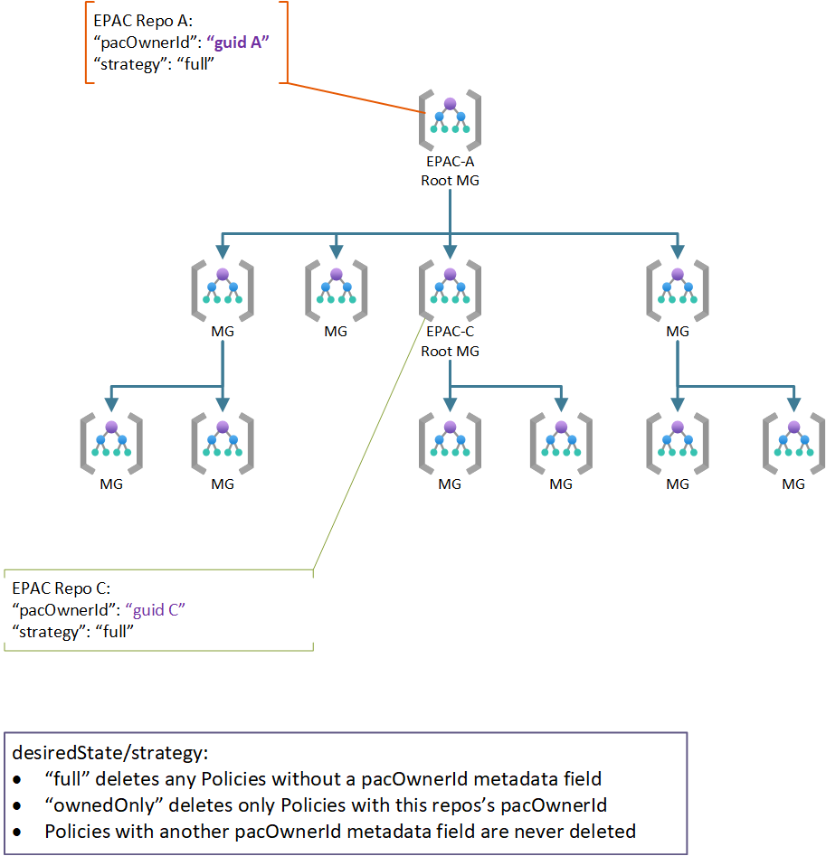

# Desired state strategy

Desired State strategy enables shared responsibility scenarios. the following documents the archetypical use cases. For complex scenarios it is possible to combine multiple use cases (e.g., Use case 2a and 3, use case 1 and 2a, ...).

## Use Case 1: Centralized Team

This original (previously the only) use case assumes one team/repo manages all Policies in a tenant or multiple tenants. `global-settings.jsonc` must ***not*** contain the following entries:

* `inheritedDefinitionsScopes`
* `desiredState`

## Use Case 2: Multiple Teams with Shared Responsibility

In a shared responsibility model multiple teams manage the same tenant(s) at the same scope. Additionally, a variant of this use case is well suited to what previously was called `brownfield` which needs to preserve Policy resources deployed prior to EPAC. The following diagram shows two EPAC solutions managing the same root (tenant). Other Policy as Code solutions can also participate if the solution sets `metadata.pacOwnerId`.


For standard behavior where each repo manages, no additional entries in `global-settings.jsonc` are necessary since the default strategy `full` is the default. `full` deletes any Policy resources without a `pacOwnerId`; however, id does not delete Policy resources with a different `pacOwnerId`.

You may add the following JSON for clarity/documentation of the default behavior.

```json
"desiredState": {
    "strategy": "full"
}
```

## Use Case 3:  Multiple Teams in a Hierarchical Organization

The hierarchical model allows a central team to manage the commonality while giving parts of the organization a capability to further restrict resources with Policies. This is a common scenario in multi-national corporations with additional jurisdictional requirements (e.g., data sovereignty, local regulations, ...).

Additionally, it is possible for a solution at a child scope to inherit Policy definitions.



Repo A is managed the same as in use cases 1, 2 and 2a. Repo C sets sets the same as repo B in use case 2 or 2a. If inheriting Policy definitions from the parent EPAC solution, add `inheritedDefinitionsScopes` to `global-settings.jsonc`. Inherited definition scopes used but not managed by this repository, scopes must be visible from `deploymentRootScope`.

```json
"inheritedDefinitionsScopes": [],
"desiredState": {
    "strategy": "full"
}
```

## Use Case 4: Transitioning to EPAC

While transitioning to EPAC, existing Policy resources may need to be kept. Setting `desiredState` to `ownedOnly` allows EPAC to remove its own resources while preserving instances requiring (temporary) preservation.


```json
"desiredState": {
    "strategy": "ownedOnly"
}
```

!!! warning
    **Breaking change:** Previously this was accomplished with the `brownfield` variable in the pipeline used to set the `SuppressDeletes` flag on the planning script. Unfortunately, the previous approach was to course-grained, preventing an EPAC solution to remove its own deprecated Policy resources. The above is the new approach to the problem

## Use Case 5: Exclude some Scopes and Policy Resources

In rare cases you may need to exclude individual child scopes, or Policy resources from management by an EPAC solution.

### Child Scope not Managed and Not Subject to these Policies

Child scope is managed by some other means. The use of a EPAC development Management Group under the same root is such an example. Another example is a child scope managed by a different organization not subject to the root scope Policies.

You use `globalNotScopes` to exclude a child scope from management by EPAC. The following example excludes the `childScope` from management by EPAC. See also [Definitions and Global Settings](definitions-and-global-settings.md#global-settings)

```json
    "globalNotScopes": {
        "tenant": [
            "/providers/Microsoft.Management/managementGroups/mg-policy-as-code"
        ]
    },
```

### Child Scopes not Managed by any EPAC repo but Subject to these Policies

This happens when EPAC `strategy` is `full` and some child scopes contain Policy resources not managed by an EPAC repo (delivered through some other deployment method). You can exclude them based on:

- Scopes (Management Groups, subscriptions and Resource Groups) through `desiredState.excludedScopes`
- Policy Definitions through `desiredState.excludedPolicyDefinitions`
- Policy Set Definitions through `desiredState.excludedPolicySetDefinitions`
- Policy Assignments through `desiredState.excludedPolicyAssignments`

You can exclude any combination of `excludedScopes`, `excludedPolicyDefinitions`, `excludedPolicySetDefinitions` and `excludedPolicyAssignments`. Any of the strings can contain simple wild cards.

Examples

```json
"desiredState": {
    "strategy": "full",
    "excludedScopes": [ // Management Groups, Subscriptions, Resource Groups
        "/providers/Microsoft.Management/managementGroups/mg-policy-as-code/childScope"
    ],
    "excludedPolicyDefinitions": [
        "/subscriptions/*/providers/Microsoft.Authorization/policyDefinitions/childScope-policy"
    ],
    "excludedPolicySetDefinitions": [
        "/providers/Microsoft.Management/managementGroups/mg-policy-as-code/providers/Microsoft.Authorization/policySetDefinitions/pattern-policy-set-*",
        "/providers/Microsoft.Management/managementGroups/mg-policy-as-code/providers/Microsoft.Authorization/policySetDefinitions/one-of-policy-set"
    ],
    "excludedPolicyAssignments": [
        "/subscriptions/*/providers/Microsoft.Authorization/policyAssignments/my-*"
    ]
}
```


## Use case 6: Include Resource Groups

By default, Policy Assignments at resource groups are not managed by EPAC. Prior to v6.0, managing resource groups was to expensive. **Breaking change:** If you used the `-IncludeResourceGroup` switch in prior versions, set `includeResourceGroups` to `true` to achieve the same effect.

```json
"desiredState": {
    "strategy": "full",
    "includeResourceGroups": true
}
```

## Use case 7: Manage Policy Definitions, Assignments, or Exemptions differently

In some organizations the lifecycle of different parts may be managed separately. For example, you may have one repo to manage Definitions and Assignments separately from Exemptions. Since the ownership of Exemptions is managed from the Assignment `pacOwnerId`, changing it is not effective.

EPAC only manages items with a directory in the `Definitions` folder. Therefore, you can use the same `pacOwnerId` from  two repos and remove the folders to separate them. In this example:

* Repo1: `Definitions` contains `policyDefinitions`, `policySetDefinitions` and `policyAssignments` folders.
* Repo2: `Definitions` contains `policyExemptions` folder.

Policy resource that would be defined in the folderIt is important to remove the folders. If you have an empty folder, EPAC will delete any item which the folder could define from your environment.
