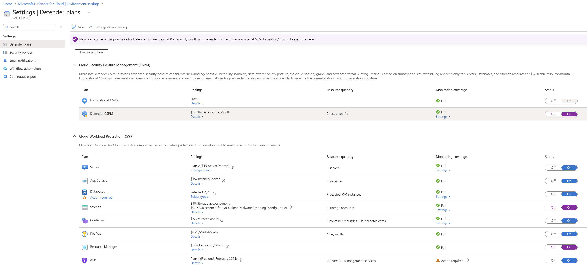

# Managing Defender for Cloud Assignments

Defender for Cloud (DFC) is a suite of Azure Security Center (ASC) capabilities that helps you prevent, detect, and respond to threats. It provides you with integration of Microsoft's threat protection technology and expertise. For more information, see [Azure Defender for Cloud](https://docs.microsoft.com/en-us/azure/security-center/defender-for-cloud).

## Behavior of EPAC Prior to v9.0.0

Defender for Cloud uses Azure Policy Assignments to enable and configure the various capabilities. These assignments are created at the subscription level.

* Policy Assignments required for [Defender plans](#defender-for-cloud-settings-for-defender-plans) (e.g., SQL, App Service, ...)
* Policy Assignments required for [Security policies](#defender-for-cloud-settings-for-security-policy-sets) (e.g., Microsoft Cloud Security Benchmark, NIST 800-53 Rev 5, NIST 800-171, ...)

Prior to v9.0.0 of EPAC, Defender for Cloud Assignments were removed by EPAC. This was a problem for Microsoft's customers, especially for Defender Plans. 

## Revised behavior of EPAC Starting with v9.0.0:

* EPAC **no longer manages (removes)** `Defender for Cloud`'s Policy Assignments required for enabled Defender Plans. 
* EPAC behavior for Security Policy **is controlled by** the `keepDfcSecurityAssignments` in `desiredState` setting per `pacEnvironment` in `global-settings.jsonc`.
    * If set to `true` or `strategy` is `ownedOnly`, EPAC will **not** remove Security Policy assignments created by Defender for Cloud.
    * If **omitted** or **set to `false`** and `strategy` is `full`, EPAC will remove Security Policy Set Assignments created by Defender for Cloud.

    ```json
    "desiredState": {
        "strategy": "full",
        "keepDfcSecurityAssignments": true
    }
    ```

**Security Policies should be manged by EPAC at the Management Group level**; this is the recommended approach for managing Security Policies instead of relying on the auto-assignments.

## Defender for Cloud Settings

### Defender for Cloud settings for Defender Plans



### Defender for Cloud settings for Security Policy Sets


