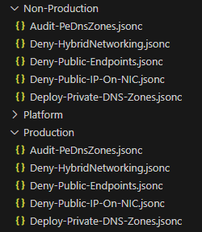

# Integrating EPAC with the Azure Landing Zones Library (New)

## Pre-requisites

To use the ALZ policies in an environment successfully there are some Azure Resources that need to be created. This is normally completed by using one of the ALZ accelerators to deploy the environment however if you have written your own code or modified the default deployment ensure you have the following resources in place to support the ALZ policies.

- Log Analytics workspace
- DCR rules to support monitoring - [data collection rule templates](https://github.com/Azure/Enterprise-Scale/tree/main/eslzArm/resourceGroupTemplates)
- User Assigned Managed Identity to support Azure Monitor Agent - [sample template](https://github.com/Azure/Enterprise-Scale/blob/main/eslzArm/resourceGroupTemplates/userAssignedIdentity.json)

## Using the new Azure Landing Zone Library sync process

### Create a policy default structure file

This file contains information that drives the sync process. The file includes management group IDs, default enforcement mode, and parameter values. **It must be generated at least once before executing the sync process.**

1. Ensure that the EPAC module is up to date - required minimum version to use these features is 10.9.0.
2. Use to code to clone the library repository and create the default file. There are examples below on how to run this command - you will only need to run one of these depending on your requirements.

```ps1
# Create a Pac Environment default file for ALZ policies using the latest release of the ALZ Library release
New-ALZPolicyDefaultStructure -DefinitionsRootFolder .\Definitions -Type ALZ -PacEnvironmentSelector "epac-dev"

# Create a default file for ALZ policies specifying a tagged release of the ALZ Library 
New-ALZPolicyDefaultStructure -DefinitionsRootFolder .\Definitions -Type ALZ -Tag "platform/alz/2025.02.0"

# Create a default file for ALZ policies by providing a path to a cloned/modified library 
New-ALZPolicyDefaultStructure -DefinitionsRootFolder .\Definitions -Type ALZ -LibraryPath <<path to library>>

# Create a default file for AMBA policies using the latest release of the ALZ Library
New-ALZPolicyDefaultStructure -DefinitionsRootFolder .\Definitions -Type AMBA
```

3. The file generated contains a representation of a management group structure, enforcement mode settings and required default parameter values. Update these values to match your environment.

An example of where to update a parameter

```json
"ama_vm_insights_data_collection_rule_id": {
      "policy_assignment_name": [
        "Deploy-VM-Monitoring",
        "Deploy-VMSS-Monitoring",
        "Deploy-vmHybr-Monitoring"
      ],
      "description": "The data collection rule id that should be used for the VM Insights deployment.",
      "parameters": {
        "parameter_name": "dcrResourceId",
        "value": "" // Update the value here as required by the description
      }
    }
```

An example of where to update a management group ID

```json
"management": {
      "management_group_function": "Management",
      "value": "/providers/Microsoft.Management/managementGroups/management" //replace with your management group ID
    },
```

Modify the default enforcement mode

```json
"enforcementMode": "Default" // Can be Default or DoNotEnforce
```

### Schema

A schema is available to add to existing policy structure files. Add the key as below.

```json
{
  "$schema": "https://raw.githubusercontent.com/Azure/enterprise-azure-policy-as-code/main/Schemas/policy-structure-schema.json"
```

### Sync with ALZ Policy Repo

The next command will generate policy assignments based on the values in this file so ensure they are correct for your environment.

1. Use to code to sync the policy files and update scopes and parameters based on the information in the previously created file. There are examples below on how to run this command - you will only need to run one of these depending on your requirements. The files will be copied into their own folder to separate them from any definitions already in the repository.

```ps1
# Sync the ALZ policies and assign to the "epac-dev" PAC environment.
Sync-ALZPolicyFromLibrary -DefinitionsRootFolder .\Definitions -Type ALZ -PacEnvironmentSelector "epac-dev"

# Sync the ALZ policies and assign to the "epac-dev" PAC environment. Specify a released version of the ALZ library
Sync-ALZPolicyFromLibrary -DefinitionsRootFolder .\Definitions -Type ALZ -PacEnvironmentSelector "epac-dev" -Tag "platform/alz/2025.02.0"

# Sync the ALZ policies from a cloned/modified library
Sync-ALZPolicyFromLibrary -DefinitionsRootFolder .\Definitions -Type ALZ -PacEnvironmentSelector "epac-dev" -LibraryPath <<path to library>>

# Sync the AMBA policies and assign to the "epac-dev" PAC environment.
Sync-ALZPolicyFromLibrary -DefinitionsRootFolder .\Definitions -Type AMBA -PacEnvironmentSelector "epac-dev"

# Sync the AMBA policies and assign to the "epac-dev" PAC environment. Specify a released version of the ALZ library
Sync-ALZPolicyFromLibrary -DefinitionsRootFolder .\Definitions -Type AMBA -PacEnvironmentSelector "epac-dev" -Tag "platform/amba/2025.06.0"

```

Carefully review the generated policy assignments and ensure all parameter and scope information is correct.

2. When complete run `Build-DeploymentPlans` to ensure the correct changes are made. During the first sync for either a new or existing environment there will be many changes due to updating of the existing policies.

## Examples

### ALZ

```ps1
# Create a Pac Environment default file for ALZ policies using the latest release of the ALZ Library 
New-ALZPolicyDefaultStructure -DefinitionsRootFolder .\Definitions -Type ALZ -PacEnvironmentSelector "epac-dev"

# Sync the ALZ policies and assign to the "epac-dev" PAC environment.
Sync-ALZPolicyFromLibrary -DefinitionsRootFolder .\Definitions -Type ALZ -PacEnvironmentSelector "epac-dev"
```

### AMBA (ALZ)

For users interested in deploying the [Azure Monitor Baseline Alerts](https://azure.github.io/azure-monitor-baseline-alerts/welcome/) project with EPAC use the commands below.

> [!Note]
> It is recommended to review breaking changes on the [AMBA Releases](https://azure.github.io/azure-monitor-baseline-alerts/patterns/alz/HowTo/UpdateToNewReleases/) page to avoid unexpected failed policy deployments. In most cases, it's an update of a parameter type (i.e. String -> Array).

```ps1
# Create a Pac Environment default file for AMBA policies using the latest release of the ALZ Library 
New-ALZPolicyDefaultStructure -DefinitionsRootFolder .\Definitions -Type AMBA -PacEnvironmentSelector "epac-dev"

# Sync the AMBA policies and assign to the "epac-dev" PAC environment.
Sync-ALZPolicyFromLibrary -DefinitionsRootFolder .\Definitions -Type AMBA -PacEnvironmentSelector "epac-dev"
```

### SLZ

For users interested in deploying the [Sovereignty Policy Baseline](https://github.com/Azure/sovereign-landing-zone/blob/main/docs/scenarios/Sovereignty-Baseline-Policy-Initiatives.md) project with EPAC use the commands below.

```ps1
# Create a Pac Environment default file for SLZ policies using the latest release of the ALZ Library 
New-ALZPolicyDefaultStructure -DefinitionsRootFolder .\Definitions -Type SLZ -PacEnvironmentSelector "epac-dev"

# Sync the SLZ policies and assign to the "epac-dev" PAC environment.
Sync-ALZPolicyFromLibrary -DefinitionsRootFolder .\Definitions -Type SLZ -PacEnvironmentSelector "epac-dev"
```

## Advanced Scenarios

Using the format of the Azure Landing Zones repository it is possible to enable some advanced scenarios. Many of these are based around customization to the recommended ALZ management group structure. It is recommended to maintain your own fork of the ALZ Library in some of these cases.

### Maintaining multiple ALZ/AMBA environments

If you need to have separate parameter values or different management group names for different PAC environments you can follow steps below.

1. Generate a policy structure file using `New-ALZPolicyDefaultStructure` and specify the `-PacEnvironmentSelector` parameter.

This generates a standard file structure however the file's name will now include the Pac Selector given. This default structure will now be used every time you run the "Sync-ALZPolicyFromLibrary" command with the matching PacEnvironmentSelector.

For example: -

```
alz.policy_default_structure.<PAC SELECTOR>.jsonc
```

2. When syncing policies run the `Sync-ALZPolicyFromLibrary` once for each PAC Environment. A folder specific for that Pac Selector will now be placed within the ALZ Type.

### Disabling / Changing specific parameters

If you need to disable a single policy parameter, such as the 'effect' for a specific policy within an assignment, add that parameter to your default file structure to ensure it is not overwritten when running the **Sync-ALZPolicyFromLibrary** command.

An example of disabling the **"Configure Microsoft Defender for Key Vault plan"** in the **"Deploy-MDFC-Config-H224"** Policy Assignment.

```json
"enableAscForKeyVault_effect": {
      "policy_assignment_name": [
        "Deploy-MDFC-Config-H224"
      ],
      "description": "Enable or disable the execution of the Key Vault DFC policy.",
      "parameters": {
        "parameter_name": "enableAscForKeyVault",
        "value": "Disabled" // Update the value here as required by the description
      }
    }
```

### Deploying Workload Specific Compliance Guardrails

To deploy the workload specific compliance guardrails for Azure Landing Zones the default policy structure file should contain an `enforceGuardrails` key. If it doesn't you can rerun the `New-ALZPolicyDefaultStructure` command to generate a file containing this entry.

By default ALZ specifies deploying all the guardrail policies to the `platform` and `landingzones` management group and when the `Sync-ALZPolicyFromLibrary` with the `-CreateGuardrailAssignments` parameter command runs it will generate assignments which are scoped to these management groups.

To modify this behavior you can update/modify the scopes in the `deployment.scopes` entry - or if you want to deploy different guardrails to different scopes simply create another entry within the `enforceGuardrails.deployment` array similar to below.

```
"enforceGuardrails": {
    "deployments": [
      {
        "scope": [
          "/providers/Microsoft.Management/managementGroups/landingzones"
        ],
        "policy_set_names": [
          "Enforce-Guardrails-APIM",
          "Enforce-Guardrails-AppServices",
          "Enforce-Guardrails-Automation"
        ]
      },
      {
        "scope": [
          "/providers/Microsoft.Management/managementGroups/platform"
        ],
        "policy_set_names": [
          "Enforce-Guardrails-APIM",
          "Enforce-Guardrails-AppServices",
          "Enforce-Guardrails-Automation"
        ]
      }
    ]
}
```

Example to generate assignments with guardrails assignments included.

```
# Sync the ALZ policies and assign to the "epac-dev" PAC environment.
Sync-ALZPolicyFromLibrary -DefinitionsRootFolder .\Definitions -Type ALZ -PacEnvironmentSelector "epac-dev" -CreateGuardrailAssignments
```

### Using a custom library for custom management group structures

Azure environments may not always be aligned with the default management group structure suggested by Azure Landing Zones. In this case it is required to maintain your own version of the Azure Landing Zone library repository and make changes in there to the default structure. This will increase the overall complexity in maintaining synchronization as you will have to manage any updates to the forked repository.

In the example below it follows a typical customer customization where instead of having a corp/online management group structure it has been elected to use a non-production/production management group structure.

The updated management group structure would follow similar to below:-

```
--Azure Landing Zones MG
 |_Non-Production MG
 |_ Production MG
```

1. Create a fork of the [Azure Landing Zone Library](https://github.com/Azure/Azure-Landing-Zones-Library) and clone it locally. When later running the `New-ALZPolicyDefaultStructure` and `Sync-ALZPolicyFromLibrary` commands you will need to ensure the `-LibraryPath` parameter points to this cloned repo.
2. For ALZ there are two files which need to be updated - firstly we need to add the new management group archetypes into the `\platform\alz\architecture_definitions\alz.alz_architecture_definition.json` file. In this example I will remove the `corp` and `online` entries from this file and replace them with a non-production and production key as below:-

```
{
      "archetypes": [
        "non-production"
      ],
      "display_name": "Non-Production",
      "exists": false,
      "id": "non-production",
      "parent_id": "landingzones"
    },
    {
      "archetypes": [
        "production"
      ],
      "display_name": "Production",
      "exists": false,
      "id": "production",
      "parent_id": "landingzones"
    }
```

3. Now that the new archetypes have been added there needs to be archetype definition files created - which tie together which assignments are associated to these archetypes. For this example we will apply the same assignments as what would have been applied to the `corp` management group to the new management groups.
4. In the forked repository in the folder `\platform\alz\archetype_definitions` we can copy the `corp.alz_archetype_definition.json` file twice and rename it to `non-production.alz_archetype_definition.json` and `production.alz_archetype_definition.json`. For each file update the `name` key in the file to match e.g.

```
{
  "$schema": "https://raw.githubusercontent.com/Azure/Azure-Landing-Zones-Library/main/schemas/archetype_definition.json",
  "name": "production",
  "policy_assignments": [
    "Audit-PeDnsZones",
    "Deny-HybridNetworking",
    "Deny-Public-Endpoints",
    "Deny-Public-IP-On-NIC",
    "Deploy-Private-DNS-Zones"
  ],
  "policy_definitions": [],
  "policy_set_definitions": [],
  "role_definitions": []
}
```

5. Since the `corp` and `online` archetypes no longer exist I can rename the archetype files for these with a `.bak` extension so the sync script does not include them.
6. The new structure file can now be generated - for example:-

```
New-ALZPolicyDefaultStructure -DefinitionsRootFolder .\Definitions\ -Type ALZ -LibraryPath ..\alz-library-fork\ -PacEnvironmentSelector epac-dev
```

This file will contain the new management groups in the structure file as below:-

```
"non-production": {
  "value": "/providers/Microsoft.Management/managementGroups/non-production",
  "management_group_function": "Non-Production"
},
"production": {
  "value": "/providers/Microsoft.Management/managementGroups/production",
  "management_group_function": "Production"
}
```

7. Run the sync command to import the policies and generate the assignments - for example:-

```
Sync-ALZPolicyFromLibrary.ps1 -DefinitionsRootFolder .\Definitions\ -Type ALZ -LibraryPath ..\alz-library-fork\ -PacEnvironmentSelector epac-dev
```

8. There are now two new folders in the `policyAssignments\ALZ` folder as below, and looking at the assigned scope for the assignments we can see they are going to be assigned to the correct management group.



```
"scope": {
    "epac-dev": [
      "/providers/Microsoft.Management/managementGroups/non-production"
    ]
  }
```

9. When maintaining parity with updates from the ALZ team including policy changes and new assignments it will be necessary to sync your forked repo and carefully check the incoming changes.

### Migrating from the legacy sync process to the new sync process

The process to migrate from the legacy sync process to the new process mainly involves changes to how the assignment files are generated and maintained. If the environment structure is well-aligned to the Cloud Adoption Framework the process will be fairly seamless. For environments which aren't aligned it will present a little bit more of a challenge however the initial complexity is balanced by less maintenance in the future when synchronizing.

### *Cloud Adoption Framework Aligned*

Use the process [documented here](integrating-with-alz-library.md#using-the-new-azure-landing-zone-library-sync-process).

Ensure that the management groups and the parameter values are updated in the newly generated structure file. When synchronizing and running the build plan changes should be fairly minimal as all the assignments already exist - but any discrepancies should be examined as to why changes are being made.

### *Cloud Adoption Framework Unaligned*

Because the environment is not aligned to CAF - the sync process using the legacy method will already require a number of changes to the default assignment files. In this case it is best to maintain a [custom library](integrating-with-alz-library.md#using-a-custom-library-for-custom-management-group-structures).

Carefully add the new archetypes to the cloned library - ensuring that all assignments are included.

Again the sync process should be fairly simple as all the assignments already exist - however there will be more assignment files to manage. Setting up the custom library properly will ensure a seamless transition.

### Using EPAC to manage ALZ policies in place of Terraform

If you are using Terraform to manage ALZ policies but are planning on integrating EPAC - you must stop Terraform from managing the policies.

Depending on the method of deployment for your Terraform based ALZ you can use the links below to find files which can override the default archetypes containing the policy definitions and assignments. Use these in your Terraform repo to remove its ability to manage policy.

- Azure Verified Module - avm-ptn-alz - <https://github.com/anwather/epac-removetf-avm>
- Legacy CAF module - terraform-azurerm-caf-enterprise-scale - <https://github.com/anwather/epac-removetf>
