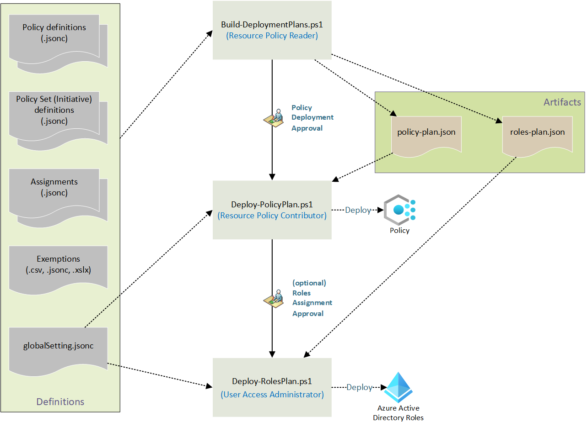

# EPAC Core Concepts

## Desired State

EPAC is a **desired state** deployment technology. When you run `Build-DeploymentPlans`, EPAC compares the policy resources defined in your repo against what is deployed in Azure. It then generates a plan to bring Azure into alignment with the repo — including **deleting** any policy resources not present in the repo.

This behavior can be adjusted using the [Desired State Strategy](../configuration/desired-state.md).

## pacEnvironments

A `pacEnvironment` represents a logical deployment target — typically one per Azure tenant or deployment ring (e.g., `epac-dev`, `tenant`). Each environment has its own:

- `deploymentRootScope` — the management group or subscription where EPAC manages policy
- `tenantId` — the Azure AD tenant
- Service principal credentials (for CI/CD)

Environments are defined in [`global-settings.jsonc`](../configuration/global-settings.md).

## Deployment Model

EPAC uses three scripts in sequence:

| Step | Script | Role Required |
|---|---|---|
| 1. Plan | `Build-DeploymentPlans` | Reader |
| 2. Deploy Policy | `Deploy-PolicyPlan` | Resource Policy Contributor |
| 3. Deploy Roles | `Deploy-RolesPlan` | Role Based Access Control Administrator |

The planning script produces `policy-plan.json` and `roles-plan.json`, which the deployment scripts consume. This separation enables approval gates between stages in CI/CD.

## PaC Ownership

EPAC tracks which policy resources it owns via `pacOwnerId` in `global-settings.jsonc`. Resources deployed by other tools (another EPAC repo, Azure Portal, legacy scripts) are treated as unmanaged and are not modified by default.

## Who Should Use EPAC?

EPAC is designed for medium and large organizations with complex policy requirements: multiple tenants, multiple teams, large numbers of policy definitions and assignments.

- **Small orgs with full IaC maturity** — EPAC works well.
- **Small orgs with lower DevOps maturity** — [Azure Landing Zones direct implementation](https://aka.ms/alz/aac) may be simpler.
- **Very small Azure customers (1–2 subscriptions)** — Microsoft Defender for Cloud automated assignments may be sufficient.

> [!TIP]
> EPAC has a mature [integration with Azure Landing Zones](../integrations/alz-overview.md). Using ALZ together with EPAC is highly recommended.
