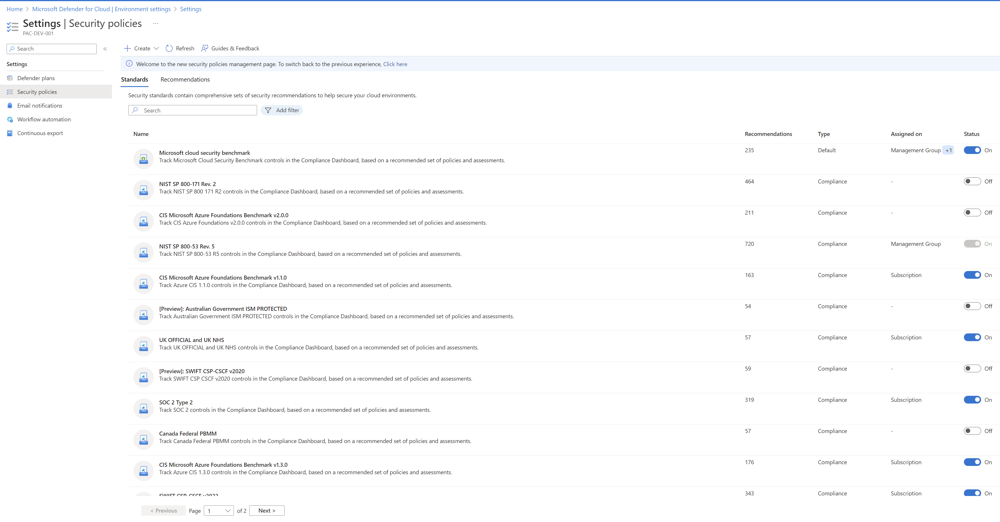

# Managing Defender for Cloud Assignments

Defender for Cloud (DFC) is a suite of Azure Security Center (ASC) capabilities that helps you prevent, detect, and respond to threats. It provides you with integration of Microsoft's threat protection technology and expertise. For more information, see [Azure Defender for Cloud](https://learn.microsoft.com/en-us/azure/defender-for-cloud/).

## Defender for Cloud Assignments for Defender Plans

Microsoft Defender for Cloud Plans provide comprehensive, cloud-native security protections across your Azure, hybrid, and multi-cloud environments. Each plan targets a specific resource type—such as servers, databases, containers, or storage—and enables advanced threat protection, vulnerability management, and compliance monitoring. To enforce these protections, Azure Policy plays a central role. When a Defender plan is enabled, Azure Policy assignments are automatically deployed to ensure that the necessary security configurations and monitoring agents are in place.

If you're managing these policies through EPAC, you can choose whether to retain or delete the Azure Policy assignments originally deployed by Defender for Cloud. The easiest way to identify which policies are linked to a specific plan is to enable that DFC plan and observe which Azure Policies are assigned as a result. For more information regarding these Azure Policies, see [Azure Policy built-in definitions for Microsoft Defender for Cloud](https://learn.microsoft.com/en-us/azure/defender-for-cloud/policy-reference).

> [!WARNING]
> EPAC behavior for Defender Plan Policies **is controlled by** the `keepDfcPlanAssignments` in `desiredState`.

- The default value for `$keepDfcPlanAssignments` is **`True`**, meaning EPAC will **not** remove "DfC Plan Policy Assignments" created by Defender for Cloud unless explicitly instructed to do so.
- In global-settings, if $keepDFCPlanAssignments is **set to `false`** and `strategy` is `full`, EPAC will remove "DfC Security Policy Assignments" created by Defender for Cloud.

```json
"desiredState": {
    "keepDfcPlanAssignments": false
}
```

### Important Considerations
- **Deletion is irreversible**: Once EPAC deletes these policy assignments, they cannot be recovered automatically.
- **Use with caution**: Only set `$keepDfcPlanAssignments` to `false` if you are confident that EPAC is fully managing and deploying the policies for each DFC Plan.

### When to Set to `false`
You may choose to set `$keepDfcPlanAssignments = $false` if:
- You have transitioned policy management from DFC to EPAC.
- You want EPAC to take full control over policy lifecycle.
- You are cleaning up legacy DFC-managed assignments.


## Defender for Cloud Security Policy Assignments

DfC automatically assigns `Microsoft cloud security benchmark` to each new subscription enrolled in Defender for Cloud. It also adds compliance Assignments when a Compliance framework is enabled, such as NIST 800-53 Rev 5, NIST 800-171, etc.

These Assignments are enabled/created at the subscription level or at management group level. Since these Policies are set to to `Audit` and you will want to set many of them to `Deny`, it is recommended that EPAC manages them at the management group level. This is the default behavior.

> [!WARNING]
> EPAC behavior for Security Policy **is controlled by** the `keepDfcSecurityAssignments` in `desiredState`.

- If set to `true` or `strategy` is `ownedOnly`, EPAC will **not** remove "DfC Security Policy Assignments" created by Defender for Cloud.
- If **omitted** or **set to `false`** and `strategy` is `full`, EPAC will remove "DfC Security Policy Assignments" created by Defender for Cloud.

```json
"desiredState": {
    "keepDfcSecurityAssignments": true
}
```


