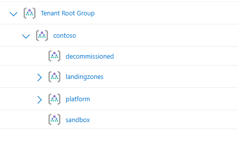
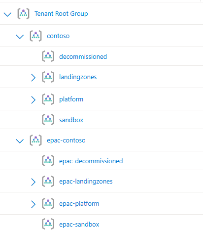
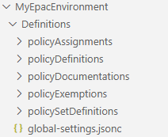

# Getting Started with EPAC

<div style="margin: 30px 0; position: relative; padding-bottom: 56.25%; height: 0; overflow: hidden; max-width: 100%; height: auto;">
  <iframe src="https://www.youtube.com/embed/GhYZChU85LA" 
          style="position: absolute; top:0; left:0; width:100%; height:100%;" 
          frameborder="0" 
          allow="accelerometer; autoplay; clipboard-write; encrypted-media; gyroscope; picture-in-picture" 
          allowfullscreen>
  </iframe>
</div>

EPAC (Enterprise Azure Policy as Code) enables you to manage Azure Policy at scale using Infrastructure as Code principles. This guide will help you understand core concepts and choose the right implementation path for your organization.

> [!IMPORTANT]
> **Take time to understand the concepts:** Understanding EPAC's core concepts is crucial for successful implementation. Don't skip the EPAC Overview section.

**What you'll learn:**

- Core EPAC concepts and terminology
- Prerequisites and permissions needed
- Implementation options (Hydration Kit vs Manual)
- How to get started quickly

## Pre-requisites

Before implementing EPAC, ensure you have the required knowledge, software, and permissions.

### Knowledge Requirements

You should understand these Azure concepts:

- [Azure Management Groups](https://learn.microsoft.com/en-us/azure/governance/management-groups/overview)
- [Azure Policy](https://learn.microsoft.com/en-us/azure/governance/policy/overview)  
- [Scope in Azure Policy](https://learn.microsoft.com/en-us/azure/governance/policy/concepts/scope)

### Software Requirements

Install the following software before proceeding:

1. **[PowerShell 7.4 or higher](https://learn.microsoft.com/en-us/powershell/scripting/install/installing-powershell)**
2. **[Az PowerShell module](https://learn.microsoft.com/en-us/powershell/azure/install-azure-powershell)**
3. **[EnterprisePolicyAsCode PowerShell Module](https://www.powershellgallery.com/packages/EnterprisePolicyAsCode)**

> [!NOTE]
> **Alternative installation:**  It is recommended to run EPAC using the `EnterprisePolicyAsCode` PowerShell Module, however, if you cannot use the PowerShell Gallery Module, you can run EPAC directly from source code. See [Forking the GitHub Repo](start-forking-github-repo.md) for details.

> [!NOTE]
> **Prerelease versions:** Experimental features may be available as prerelease versions. Use `Install-Module -AllowPrerelease` to access these, but note they are not supported for production use and may introduce breaking changes.

### Azure Permissions

You need specific Azure roles to deploy and manage policies with EPAC:

|Role|Required For|
|-----|----------|
|`Resource Policy Contributor`|Permissions to create, manage & delete Azure Policy resources|
|`Role Based Access Control Administrator`|Permissions to create, manage & delete Azure RBAC assignments|
| `Management Group Contributor` | Create Management Groups (Hydration Kit only) |

## EPAC Overview

This section covers the essential concepts you need to understand before implementing EPAC.

### Global Settings File

EPAC relies on a `global-settings` file that contains key information about your environment that EPAC uses as inputs when running. Throughout this section, we will explore some of the key items that will need to be specified in the `global-settings` file.

The `global-settings` file is a `jsonc` files (JSON with Comments) and a Schema is available which can be used in tools such as VS Code to provide code completion.

```json
{
    "$schema": "https://raw.githubusercontent.com/Azure/enterprise-azure-policy-as-code/main/Schemas/global-settings-schema.json"
}
```

### Pac Owner ID

The `pacOwnerId` is a representative name that is used to uniquely identify deployments from this instance of EPAC. We recommend simply generating and using a GUID for this.

```json
{
    "$schema": "https://raw.githubusercontent.com/Azure/enterprise-azure-policy-as-code/main/Schemas/global-settings-schema.json",
    "pacOwnerId": "11111111-2222-3333-4444-555555555555",
}
```

### Deployment Root Scope

The `deploymentRootScope` defines where EPAC manages policies. EPAC can deploy and manage policies at this scope and any scope below it in the Azure hierarchy. EPAC is a desired state deployment technology and meant to manage **all** policy resources within the specified `deploymentRootScope` and act as the 'single source of truth' for Azure Policy.

**Example:** Setting `deploymentRootScope` to the Contoso organization's Management Group (e.g., `contoso`) allows EPAC to manage policies across all child Management Groups and subscriptions.



> [!IMPORTANT]
> **Avoid Tenant Root Group:** Set your `deploymentRootScope` to an Intermediate Root Management Group rather than the Tenant Root Group to maintain flexibility and avoid lockout scenarios.  This is discussed in further detail in the Azure Cloud Adoption Framework [guidance](https://learn.microsoft.com/en-us/azure/cloud-adoption-framework/ready/landing-zone/design-area/resource-org-management-groups).

### EPAC Environments Overview

Like any other solution or application, a development area is required to test and validate the solution before deploying to production. EPAC is the same, **however**, since Azure Policy affects all resources in your tenant, you need isolated space for policy development.

**The Challenge:** Testing new policies, or policy updates anywhere within your standard Management Group hierarchy could:

- Disrupt existing workloads
- Create compliance issues
- Impact other teams' work

For example, you may have an Azure policy assigned to control networking configuration, say to manage the firewall settings on storage accounts. This applies for all workload types (platform, security, applications) and for all SDLC environments (production, development, sandbox, etc). You may need to update this policy, for instance to add a new allowed IP address. This policy needs to be tested before it rolls out to any scope within your environment to ensure there's no issues and its behaving accordingly.

**The Solution:** EPAC has the concept of **EPAC Environments**, or `pacEnvironments` providing isolated policy management with its own deployment scope.

- Each **EPAC Environment** has a symbolic name (`pacSelector`) and its own distinct `deploymentRootScope`
- Each **EPAC Environment** is targeted separately for deployments, allowing you to manage policies independently.

### Typical EPAC Environment Setup

Each **EPAC Environment** provides isolated policy management with its own deployment scope. This separation is crucial for safe policy development.

**Typical Setup:**

- **Tenant Environment** (`tenant01`): Manages policies in your main Management Group hierarchy
- **Development Environment** (`epac-dev`): Manages policies in a separate, cloned Management Group hierarchy

**Benefits of Separate Environments:**

- Test policy changes without affecting other workloads
- Validate compliance frameworks before deployment
- Safely experiment with new policy configurations
- Maintain audit trails for policy changes



> [!TIP]
> The development environment typically mirrors your production Management Group structure, giving you a representative testing environment.

The `global-settings` file, would then look something like this:

```json
{
    "$schema": "https://raw.githubusercontent.com/Azure/enterprise-azure-policy-as-code/main/Schemas/global-settings-schema.json",
    "pacOwnerId": "11111111-2222-3333-4444-555555555555",
    "pacEnvironments": [
        {
            "pacSelector": "tenant01",
            "deploymentRootScope": "/providers/Microsoft.Management/managementGroups/contoso"
        },
        {
            "pacSelector": "epac-dev",
            "deploymentRootScope": "/providers/Microsoft.Management/managementGroups/epac-contoso"
        }
    ]
}
```

> [!IMPORTANT]
> **epac-dev:**It is **strongly recommended** to create your development **EPAC Environment** with a `deploymentRootScope` that is **separate** from the rest of your tenant. Remember that EPAC expects to manage **ALL** policies within its `deploymentRootScope` and each `pacEnvironment` is independent, so creating an **EPAC Environment** that is nested within the `deploymentRootScope` of another **EPAC Environment** is generally not recommended.

> [!Tip]
> **Main pacEnvironment Name:** You'll notice that we gave our main `pacEnvironment` the name `tenant01` instead of something like `production` and that **"EPAC Environment"** has been consistently bolded throughout the documentation. This is to create a distinction between environments that EPAC uses (`pacEnvironments`) and your general SDLC environments within your company (Prod, test, qa, dev, etc.) and Azure tenant. As discussed, it is important to separate the "Development" **EPAC Environment** from your regular development environments.

### Managed Identities

DeployIfNotExists (DINE) policies require a managed identity to function. If you are not familiar with this, please review the [Azure Policy documentation](https://learn.microsoft.com/en-us/azure/governance/policy/concepts/effect-deploy-if-not-exists). For each `pacEnvironment` we will need to specify a *default* Azure Location (e.g. EastUS) where managed identities used by Azure Policy will be created.

```json
{
    "$schema": "https://raw.githubusercontent.com/Azure/enterprise-azure-policy-as-code/main/Schemas/global-settings-schema.json",
    "pacOwnerId": "11111111-2222-3333-4444-555555555555",
    "pacEnvironments": [
        {
            "pacSelector": "tenant01",
            "deploymentRootScope": "/providers/Microsoft.Management/managementGroups/contoso",
            "managedIdentityLocation": "eastus2"
        },
        {
            "pacSelector": "epac-dev",
            "deploymentRootScope": "/providers/Microsoft.Management/managementGroups/epac-contoso",
            "managedIdentityLocation": "eastus2"
        }
    ]
}
```

> [!NOTE]
> EPAC provides the ability to specify the location individually on each policy assignment. The location specified in the `pacEnvironment` is a default location incase one is not specified in the assignment.

### Multi-Tenant Capabilities

EPAC supports single and multi-tenant configurations including:

- **Multiple Azure tenants** from a single EPAC instance
- **Azure Lighthouse managed tenants**
- **Cross-tenant role assignments** for centralized management

Each `pacEnvironment` has a `tenantId` property to enable these scenario(s):

```json
{
    "$schema": "https://raw.githubusercontent.com/Azure/enterprise-azure-policy-as-code/main/Schemas/global-settings-schema.json",
    "pacOwnerId": "11111111-2222-3333-4444-555555555555",
    "pacEnvironments": [
        {
            "pacSelector": "tenant01",
            "deploymentRootScope": "/providers/Microsoft.Management/managementGroups/contoso",
            "tenantId": "77777777-8888-9999-1111-222222222222",
            "managedIdentityLocation": "eastus2"
        },
        {
            "pacSelector": "epac-dev",
            "deploymentRootScope": "/providers/Microsoft.Management/managementGroups/epac-contoso",
            "tenantId": "77777777-8888-9999-1111-222222222222",
            "managedIdentityLocation": "eastus2"
        }
    ]
}
```

> [!TIP]
> It is possible to use this multi-tenant functionality for the "development" **EPAC Environment** (`epac-dev`) Discussed above; however, it is not necessary since EPAC has sophisticated partitioning capabilities. Generally, the multi-tenant functionality should be reserved for true multi-tenant scenarios.

### Configuration Files and Structure

EPAC uses a simple folder structure to organize all policy resources:



**Key Files:**

- **`global-settings.jsonc`**: Central configuration file defining environments and settings
- **`policyDefinitions/`**: Custom policy definitions
- **`policySetDefinitions/`**: Policy initiative (set) definitions  
- **`policyAssignments/`**: Policy assignments to scopes
- **`policyExemptions/`**: Exemptions from policy enforcement

## Implementation Path

**Quick Start Decision Tree**

```
Are you new to EPAC? → YES → Use the Hydration Kit (recommended)
                     ↓
Do you need advanced customization? → NO → Use the Hydration Kit
                                    ↓
Do you have complex multi-tenant requirements? → YES → Manual Configuration
                                               ↓
                                              NO → Use the Hydration Kit
```

### Recommended: Hydration Kit

**Best for:** Most users, especially those new to EPAC

**What it provides:**

- Interactive setup with guided decisions
- Setup of folder structure & generation of `global-settings.jsonc`
- Automatic creation of `epac-dev` environment
- Starter policies and compliance frameworks
- Starter CI/CD pipeline templates

**Next step:** [Hydration Kit Guide](./start-hydration-kit.md)

### Alternative: Manual Configuration

**Best for:** Advanced users with specific customization needs

**What it provides:**

- Full control over every configuration aspect
- Ability to integrate with existing setups
- Custom folder structures and naming
- Advanced multi-tenant scenarios

**Next step:** [Manual Configuration Guide](./manual-configuration.md)

### Not Sure Which to Choose?

Start with the **Hydration Kit** as you can always customize the generated configuration afterward. The Hydration Kit creates a solid foundation to build upon.

## Need Help?

If you encounter issues during implementation:

- **Run scripts interactively** to see detailed output
- **[Debug in VS Code](https://learn.microsoft.com/en-us/powershell/scripting/dev-cross-plat/vscode/using-vscode?view=powershell-7.3)** for step-by-step troubleshooting
- **[Open a GitHub Issue](https://github.com/Azure/enterprise-azure-policy-as-code/issues)** for community support
