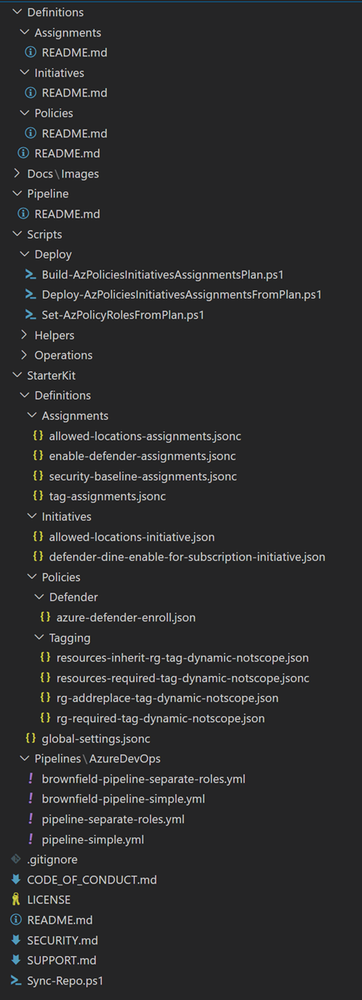

# Policy as Code

## Table of Contents

In this file:

- [Security & Compliance for Cloud Infrastructures](#security--compliance-for-cloud-infrastructure)
- [Scenarios](#scenarios)
- [GitHub repository: How to clone or fork, update and contribute](#github-repository-how-to-clone-or-fork-update-and-contribute)
- [Quick Start](#quick-start)
  - [Starter Kit](#starter-kit)
  - [EPAC Policy Reader role (custom)](#policy-reader-role-custom)
  - [Required Management Groups and subscriptions](#required-management-groups-and-subscriptions)
  - [Service connections for DevOps CI/CD](#service-connections-for-devops-cicd)
  - [EPAC environments setup](#epac-environments-setup)
  - [Azure DevOps CI/CD Pipeline](#azure-devops-cicd-pipeline)
  - [Edit and create Policies, Initiatives and Assignments](#edit-and-create-policies-initiatives-and-assignments)
- [GitHub Folder Structure](#github-folder-structure)
- [Sync-Repo.ps1](#sync-repops1)
- [Components](#components)
- [Reading List](#reading-list)
- [Contributing](#contributing)
- [Trademarks](#trademarks)

More details:

- [Pipeline](Pipeline/README.md)
- [Update Global Settings](Definitions/README.md)
- [Create Policy Definitions](Definitions/Policies/README.md)
- [Create Initiative Definitions](Definitions/Initiatives/README.md)
- [Define Policy Assignments](Definitions/Assignments/README.md)
- [Define Policy Exemptions](Definitions/Exemptions/README.md)


- [Documenting Assignments and Initiatives](Definitions/Documentation/README.md)
- [Operational Scripts](Scripts/Operations/README.md)

<br/>

> **Desired State Warning**
>
> **If you have a existing Policies, Initiatives and Assignments in your environment, you have not transferred to EPAC, do not forget to change the "brownfield" variable in the pipeline to true.**
>
> This solution uses the desired state strategy. It will remove any custom Policies, Initiatives or Policy Assignments not duplicated in the definition files. The Build-AzPoliciesInitiativesAssignmentsPlan.ps1 script's switch parameter SuppressDeletes changes this behavior. Set the "brownfield" variable in the pipeline to true; it will set the switch parameter preventing deletions of existing Policies, Initiatives and Policy Assignments. This allows for a gradual transition from your existing Policy management to Enterprise Policy as Code.

<br/>

## Security & Compliance for Cloud Infrastructure

This `enterprise-policy-as-code` **(EPAC)** repo has been developed in partnership with the Security & Compliance for Cloud Infrastructure (S&C4CI) offering available from Microsoft's Industry Solutions (Consulting Services). Microsoft Industry Solutions can assist you with securing your cloud. S&C4CI improves your new or existing security posture in Azure by securing platforms, services, and workloads at any scale.

<br/>

## Scenarios

The Policy as Code framework supports the following Policy and Initiative assignment scenarios:

- **Centralized approach**: One centralized team manages all policy and initiative assignments in the Azure organization, at all levels (Management Group, Subscription, Resource Group).
- **Distributed approach**: Multiple teams can also manage policy and initiative assignments in a distributed manner if there's a parallel set Management Group hierarchies defined. In this case individual teams can have their own top level Management group (and corresponding Management Groups hierarchy with Subscriptions and Resource Groups below), but assignments must not be made on the Tenant Root Group level.
  > **NOTE**: Distributed teams must only include those scopes in their version of the assignments.json that is not covered by another team.
- **Mixed approach**: A centralized team manages policy and initiative assignments to a certain level (top-down approach), e.g. on the Tenant Root Group level, and top level Management group, and all assignments on lower levels (i.e. lower level Management Groups, Subscriptions and Resource Groups) are managed by multiple teams, in a distributed manner.

 **NOTE**: This solution enforces a centralized approach. It is recommended that you follow a centralized approach however, when using the mixed approach, scopes that will not be managed by the central team should be excluded from the assignments JSON file - therefore the assignment configuration script will ignore these scopes (it won't add/remove/update anything in there). Conversely, the distributed teams must only include those scopes in their version of the assignments.json that is not covered by the central team.

 <br/>

## GitHub repository: How to clone or fork, update and contribute

Git lacks a capability to ignore files/directories during a PR only. This repo has been organized that Definitions and Pipeline folders (except for README.md files) are not touch by syncing latest update from GitHub to your repo or reverse syncing to contribute to the project.

- Initial setup
  - Create `MyForkRepo` as a fork or clone of [GitHub repo](https://github.com/Azure/enterprise-azure-policy-as-code).
  - Create `MyWorkingRepo`.
    - Clone your forked repo.
    - Create a new repo from the clone (do not fork `MyForkRepo`).
- Work in `MyWorkingRepo`
  - Use only folders `Definitions` and `Pipeline`, except when working on fixes to be contributed back to GitHub.
  - You may add additional folders, such as a folder for your own operational scripts.
- Syncing from GitHub repo.
  - Fetch changes from GitHub to `MyForkRepo`.
  - Execute [`Sync-Repo.ps1`](#sync-repops1) to copy files from `MyForkRepo` to `MyWorkingRepo` feature branch.
  - PR `MyWorkingRepo` feature branch.
- Contribute to GitHub
  - Execute [`Sync-Repo.ps1`](#sync-repops1) to copy files from `MyWorkingRepo` to `MyForkRepo` feature branch
  - PR `MyForkRepo` feature branch.
  - PR changes in your fork (`MyForkRepo`) to GitHub.
  - GitHub maintainers will review PR.

<br/>


<br/>

## Quick start

This quick is meant as an overview. We highly recommend that you read the entire reading list before starting.

### Starter kit

The solution has a starter kit (folder `StarterKit`). Copy the contents of the `StarterKit/Definitions` folder to `Definitions` folder. Copy the pipeline definition(s) for your DevOps deployment solution (for example: Azure DevOps, GitHub) to the `Pipeline` folder.

### EPAC Policy Reader role (custom)

Create a custom role to be used by the planing stages' service connections **EPAC Policy Reader role**. Script `./Scripts/Operations/New-AzPolicyReaderRole.ps1` will create the role at the scope defined in `global-settings.json`. It will contain:
   - `Microsoft.Authorization/policyassignments/read`
   - `Microsoft.Authorization/policydefinitions/read`
   - `Microsoft.Authorization/policyexemptions/read`
   - `Microsoft.Authorization/policysetdefinitions/read`
   - `Microsoft.PolicyInsights/*`
   - `Microsoft.Support/*`

<br/>

### Required Management Groups and subscriptions

This solution requires EPAC environments for development, (optional) integration, and production per tenant. These environments are not the same as the standard Azure environments for solutions - do not confuse them. The regular Sandbox, DEV, DEVINT, TEST/QA and PROD environment are managed with the EPAC PROD deployment(s).

- Build a management group dedicated to Policy as Code (PaC) -- `mg-pac-dev` <br/> <https://docs.microsoft.com/en-us/azure/governance/management-groups/create-management-group-portal>
- Create two subscriptions under the PaC management group mg-pac-dev. Recommended naming:
  - PAC-DEV-001
  - PAC-TEST-001
  - <https://docs.microsoft.com/en-us/azure/cost-management-billing/manage/create-subscription>
- Note on Multi-Tenant:
  - Azure DevOps Server (if not using Azure DevOps service) and Azure Self-Hosted Agents must be in PROD tenant.
  - Management Group `mg-pac-dev` should be created in a development tenant

<br/>

### Service connections for DevOps CI/CD

Create Service Principals for the pipeline execution and setup your DevOps environment with the necessary service connections. You will need SPNs with specific roles:

- EPAC Development and Test subscriptions
  - Owner role at subscription for deploying to your EPAC development subscription
  - Owner role at subscription for deploying to your EPAC test subscription
- Per Azure tenant at your highest Management Group (called rootScope in EPAC vernacular)
  - Security Reader and EPAC Policy Reader (custom) or Policy Contributor roles for planning the EPAC prod deployment
  - Security Reader and Policy Contributor for deploying Policies, Initiatives and Assignments in the EPAC prod environment
  - User Administrator for assigning roles to the Assignments' Managed Identities (for remediation tasks) in the EPAC prod environment

### EPAC environments setup

Like any other software or X as Code solution, EPAC needs areas for developing and testing new Policies, Initiatives and Assignments before any deployment to EPAC prod environments. In most cases you will need one subscription each for development and testing. EPAC's prod environment will govern all other IaC environments (e.g., sandbox, development, integration, test/qa, pre-prod, prod, ...). This can be slightly confusing.

**Note:** This solution will refer to EPAC environments which are selected with a PAC selector and the regular environments as simply environments.

The solution needs to know the Azure scopes for your EPAC environments. This is specified in the `global-settings.jsonc` file in the `Definitions` folder. `pacEnvironments` defines the EPAC environments:

```jsonc
    "pacEnvironments": [
        {
            "pacSelector": "epac-dev",
            "cloud": "AzureCloud",
            "tenantId": "77777777-8888-9999-1111-222222222222",
            "defaultSubscriptionId": "11111111-2222-3333-4444-555555555555",
            "rootScope": {
                "SubscriptionId": "11111111-2222-3333-4444-555555555555"
            }
        },
        {
            "pacSelector": "epac-test",
            "cloud": "AzureCloud",
            "tenantId": "77777777-8888-9999-1111-222222222222",
            "defaultSubscriptionId": "99999999-8888-7777-4444-333333333333",
            "rootScope": {
                "SubscriptionId": "99999999-8888-7777-4444-333333333333"
            }
        },
        {
            "pacSelector": "tenant",
            "cloud": "AzureCloud",
            "tenantId": "77777777-8888-9999-1111-222222222222",
            "defaultSubscriptionId": "99999999-8888-7777-4444-333333333333",
            "rootScope": {
                "ManagementGroupName": "Contoso-Root"
            }
        }
    ]
```

Explanations

- You will use the `pacSelector` values in your CI/CD pipeline and when executing operational scripts.
- `cloud` is used to select clouds (e.g., `AzureCloud`, `AzureUSGovernment`, `AzureGermanCloud`, ...).
- `tenantId` is the GUID of your Azure AD tenant
- `defaultSubscriptionId` is required to resolve Azure scopes correctly.
- `rootScope` defines the location of your custom Policy and Initiative definitions. It also denotes the highest scope for an assignment. The roles for the CI/CD SPNs must be assigned here.

We explain the `managedIdentityLocations` and `globalNotScopes` elements in `global-settings.jsonc` [here](Definitions/README.md).

<br/>

### Azure DevOps CI/CD Pipeline

Setup your pipeline based on the provided starter kit pipeline. The yml file contains commented out sections to run in a IaaS Azure DevOps server (it requires a different approach to artifact storage) and for 2 additional tenants. Uncomment or delete the commented sections to fit your environment.

<br/>

> **Desired State Warning**
>
> **If you have a existing Policies, Initiatives and Assignments in your environment, you have not transferred to EPAC, do not forget to change the "brownfield" variable in the pipeline to true.**

<br/>

Pipelines can customized to fit your needs:

- Multiple tenants.
- Pull Request triggers (omitted due to the excessive time consumption).
- Simplified flows, such as now approvals needed (not a recommended practice).
- More sophisticated flows.
- Different development approach instead of GitHub flow.
- ...

<br/>

### Edit and create Policies, Initiatives and Assignments

Using the starter kit edit the directories in the `Definitions` folder. To simplify entering parameters, you can use the [Initiative documenting feature](Definitions/Documentation/README.md#documenting-assignments-and-initiatives) which creates Markdown, CSV and a JSON parameter file. You need to specify your initiatives to be documented (folder [`Definitions\Documentation`](Definitions/Documentation/README.md#specifying-initiative-documentation)) and execute script [`./Scripts/Operations/Build-PolicyAssignmentDocumentation.ps1`](Scripts/Operations/README.md#build-policyassignmentdocumentationps1)

<br/>

### Document your Assignments

This solution can generate [documentation in markdown and csv formats](Definitions/Documentation/README.md).

## GitHub Folder Structure

<br/>



<br/>

## Sync-Repo.ps1

The repo contains a script to synchronize directories in both directions: `Sync-Repo.ps1`. It only works if you do not modify

- `Docs`, `Scripts` and `StarterKit` directories
- `README.md` files in Scripts and Pipeline folders
- `CODE_OF_CONDUCT.md`, `LICENSE`, `README.md` (this file), `SECURITY.md`, `SUPPORT.md` and `Sync-Repo.ps1` in root folder

|Parameter | Required | Explanation |
|----------|----------|-------------|
| `sourceDirectory` | Required | Directory with the source (cloned or forked/cloned repo) |
| `destinationDirectory` | Required | Directory with the destination (cloned or forked/cloned repo) |
| `suppressDeleteFiles` | Optional | Switch parameter to suppress deleting files in `$destinationDirectory` tree |
| `omitDocFiles` | Optional | Switch parameter to exclude documentation files *.md, LICENSE, and this script from synchronization |


<br/>

## Components

| Component | What is it used for? | Where can it be found? |
|--|--|--|
| **Pipeline File** | Configure the deployment pipeline for Azure DevOps. **Copy a suitable sample pipeline from the samples provided to the working folder.** | Working folder: `Pipeline` <br/> Starter pipelines: <br/> `StarterKit/Pipelines` |
| **Definition Files** | Define custom policies, initiatives and assignments. This repo contains a sample for each. **Copy suitable samples as starters from the samples provided to the working folder.** | Working folder: <br/> `Definitions` <br/> Starter definitions: <br/>  `StarterKit/Definitions` |
| **Service Connections** | Service connections give the pipeline the proper permissions to deploy at desired Azure scopes. [Documentation for Service Connections](https://docs.microsoft.com/en-us/azure/devops/pipelines/library/service-endpoints) | Azure DevOps <br/> project settings  |
| **Deployment Scripts** | Scripts are used to deploy your Policies, Initiatives, and Assignments to Azure. They do not need to be modified. If you have improvements, please offer to contribute them. | Folder `Scripts/Deploy` |
| **Operational Scripts** | Scripts used to during operations (e.g., creating remediation tasks). | Folder `Scripts/Operations` |
| **Helper Scripts** | These Scripts are used by other scripts. | Folder `Scripts/Helpers` |
| **Cloud Adoption Framework Scripts** | The files in here are used to synchronize policies from the main ESLZ repository | Folder `Scripts\CloudAdoptionFramework` |

<br/>

## Reading List

1. **[Pipeline](Pipeline/README.md)**
1. **[Update Global Settings](Definitions/README.md)**
1. **[Create Policy Definitions](Definitions/Policies/README.md)**
1. **[Create Initiative Definitions](Definitions/Initiatives/README.md)**
1. **[Define Policy Assignments](Definitions/Assignments/README.md)**
1. **[Define Policy Exemptions](Definitions/Exemptions/README.md)**
1. **[Documenting Assignments and Initiatives](Definitions/Documentation/README.md)**
1. **[Operational Scripts](Scripts/Operations/README.md)**
1. **[Cloud Adoption Framework Policies](Scripts/CloudAdoptionFramework/README.md)**

<br/>

## Contributing

This project welcomes contributions and suggestions.  Most contributions require you to agree to a
Contributor License Agreement (CLA) declaring that you have the right to, and actually do, grant us
the rights to use your contribution. For details, visit <https://cla.opensource.microsoft.com>.

When you submit a pull request, a CLA bot will automatically determine whether you need to provide
a CLA and decorate the PR appropriately (e.g., status check, comment). Simply follow the instructions
provided by the bot. You will only need to do this once across all repos using our CLA.

This project has adopted the [Microsoft Open Source Code of Conduct](https://opensource.microsoft.com/codeofconduct/).
For more information see the [Code of Conduct FAQ](https://opensource.microsoft.com/codeofconduct/faq/) or
contact [opencode@microsoft.com](mailto:opencode@microsoft.com) with any additional questions or comments.

<br/>

## Trademarks

This project may contain trademarks or logos for projects, products, or services. Authorized use of Microsoft trademarks or logos is subject to and must follow
[Microsoft's Trademark & Brand Guidelines](https://www.microsoft.com/en-us/legal/intellectualproperty/trademarks/usage/general).
Use of Microsoft trademarks or logos in modified versions of this project must not cause confusion or imply Microsoft sponsorship. Any use of third-party trademarks or logos are subject to those third-party's policies.
