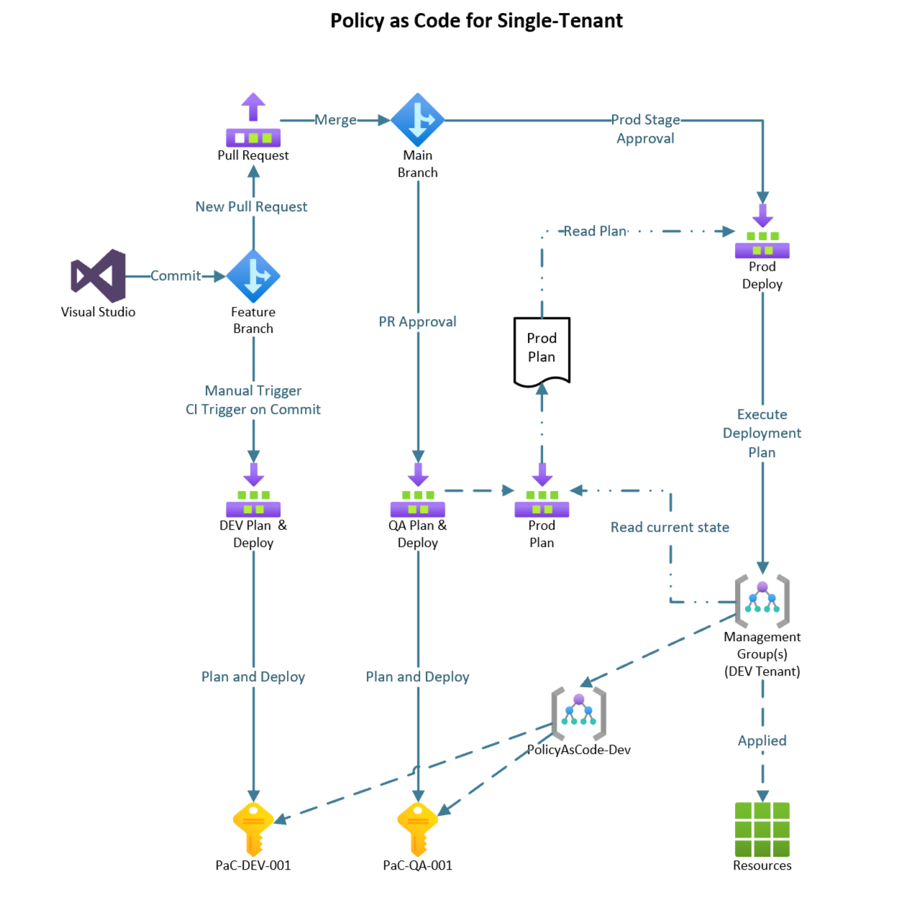

# Overview

This repository contains a mature solution to manage and deploy Azure Policy at enterprise scale.

## Azure Security Modernization

This repo has been developed in partnership with the Azure Security Modernization (ASM) offering within Microsoft's Industry Solutions (Consulting Services)

ASM improves your new or existing security posture in Azure by securing platforms, services, and workloads at any scale. ASM revolves around a continuous security improvement model (Measure, Plan, Develop & Deliver) giving visibility into security vulnerabilities.

## Content

This repository contains pipleine definitions for Azure DevOps. The authors are interested ins upporting other deployemnt pipelines. If you have developed pipelines for other technologies, such as GitHub, Jenkins, ...

Pipeline definition for a single tenat and a two tenant scenario are provided:

* Pipeline for single tenant deployment `pipeline-single.yml`
* Pipeline for multi tenant deployment `pipeline-multi.yml` wil arive soon

Piplines require configuration for your specific Azure environment. The piplelines can also be modified to provide different flows.

## Components

| Component | What is it used for? | Where can it be found? |
|--|--|--|
| **Definition Files** | Define custom policies, initiatives and assignments. This repo contains a sample for each. You will adjust them as needed, especialy the assignments | `Definitions` folder. |
| **Pipeline Files** | Configure the deployment pipeline for Azure DevOps | `Pipeline` folder. |
| **Service Connections** | Service connections give the pipeline the proper permissions to deploy at desired Azure scopes | Create in project settings: <https://docs.microsoft.com/en-us/azure/devops/pipelines/library/service-endpoints?view=azure-devops&tabs=yaml> |
| **Deployment Scripts** | Scripts are used to deploy your Policies, Initiatives, and Assignments to Azure. They do not need to be modified. If you have improvements, please offer to contribute them. | `Scripts/Deploy` folder |
| **Configuration Scripts** | Scripts are used to define the environment for Test and Operational scripts. You mst modify any environment specific values, such as Management Groups and Subscriptions. | `Scripts/Config` folder |
| **Helper and Utility Scripts** | These Scripts are used by other scripts. | `Scripts/Helpers` and <br/>`Scripts/Utils` folders |
| **Operational Scripts** | Scripts used to during operations (e.g., creating remedaition tasks). | `Scripts/Operations` folder |
| **Test Scripts** | Scripts used by this solution's developers to execute other scripts without needing to type all the parameters each time. | `Scripts/Test` folder |

<a href="#top">Back to top</a>

## Prerequisites

* Build a management group dedicated to Policy as Code (PaC): <br/> <https://docs.microsoft.com/en-us/azure/governance/management-groups/create-management-group-portal>
* Create two subscriptions under the PaC management group. Recommended naming:
  * PAC-DEV-001
  * PAC-TEST-001
  * <https://docs.microsoft.com/en-us/azure/cost-management-billing/manage/create-subscription>

## Quick Start

1. Create an Azure DevOps project dedicated to Policy as Code (PaC). You may also create a dedicated PaC repo within an existing Azure DevOps project.
1. Import this repository into the newly created PaC repository: <br/> <https://docs.microsoft.com/en-us/azure/devops/repos/git/import-git-repository?view=azure-devops>
1. Create a cusom role to be used by the planing stages' service connections. **Policy Reader role** should contain:
   * `Microsoft.Authorization/policyAssignments/read`
   * `Microsoft.Authorization/policyDefinitions/read`
   * `Microsoft.Authorization/policySetDefinitions/read`
1. Create the Service Connections in Azure DevOps with the required permissions. You need `2 + 3 x number of tenants` service connections.
   * Grant the required permissions to the SPNs in Azure. **Note:** depending on your scenario, these permissions may be very high.
      * If you're planning to use DeployIfNotExists (DINE) policies, the SPN has to have owner or user admin rights at the assignments' scope, so that it can grant access to the generated system assigned identity at deployment time. In other words, you may need owner or user admin permission on Tenant Root group level to fully unlock all the capabilities of Azure Policies deployed through this solution.
      * Some SPNs will also need `Azure Active Directory reader` role. This is required both for the permission plan creation and for assigning permissions (for DeployIfNotExists policies) as the role assignment PowerShell commandlet requires this permission.
   * Register the SPN in ADO as a Service Connection. The number of service connections is equal to 2 plus the number of tenants
   * <https://docs.microsoft.com/en-us/azure/devops/pipelines/library/service-endpoints?view=azure-devops&tabs=yaml#sep-azure-resource-manager>

1. Configure the deployment pipeline
   * Register the pipeline (pipeline.yml `Pipeline` folder of the repository).
   * Modify the pipeline to include the service connections and desired scope for your policy deployments (See the **[pipeline documentation](Docs/Pipeline.md)** file for more details on this)
   * The pipeline is triggered in various ways depending on the scope you are ready to deploy to. See the **[pipeline documentation](Docs/Pipeline.md)** to find a more detailed explanation on how each stage of the pipeline is triggered.

1. Create environments in Azure DevOps. Environments must be created to isolate deployment controls and set approval gates.
   * Create the following three environments (case sensitive):
   * PAC-ROLES
   * PAC-PROD
   * PAC-TEST
   * PAC-DEV
   * If you would like to modify the names of these environments, you must also modify the pipeline environments for each stage in the pipeline file.
1. Create policies, initiatives, and assignments as needed
   * Follow the included file structures
   * **NOTE:** if you are NOT creating a greenfield environment, you may add the suppress delete operator to the pipeline file to keep previous policies, initiatives, and assignments. Add the `-suppressDeletes` switch parameter to every instance of script `Build-AzPoliciesInitiativesAssignmentsPlan.ps1`.

     ```yaml
     scriptPath: "Scripts/Deploy/Build-AzPoliciesInitiativesAssignmentsPlan.ps1"
     arguments: -TenantId $(tenantId) `
       -AssignmentSelector $(devAssignmentSelector) `
       -RootScope $(devRootScope) `
       -PlanFile $(devPlanFile) `
       -InformationAction Continue `
       -suppressDeletes
     ```

1. Trigger the pipeline to deploy to each envrionment with these actionss:
   * DEV - Commit to feature branch or manually trigger
   * TEST - Pull request is approved
   * PROD - Azure DevOps approval gate is completed
   * ROLES - Azure DevOps role approval gate is completed (optional segregation of duty))

<a href="#top">Back to top</a>

## Pipeline Stages

| Stage | Usage | Branch | Purpose | Environments |
| :--- | :--- | :------- | :--- | :--- |
| DEV  | Required | feature | CI | PAC-DEV-001 subscription
| PROD Plan CI | CI: optional <br/> PR: recommneded | feature | CI and/or <br/> PR Condition | Tenants' root or top-level <br/> Management Group |
| TEST | Recommended | main | PR approved | PAC-TEST-001 |
| PROD Plan CD | Required | main | Plan PROD deployment | Tenants' root or top-level <br/> Management Group |
| PROD Deploy | Required | main | Deploy to PROD </br> Plan role assignments <br/> Opt: stage per tenant <br/> Opt: Modify role assignments <br/> Opt: Export roles | Tenants' root or top-level <br/> Management Group |
| PROD Roles | Required or <br/> Ext roles process | main | Modify role assignments <br/> Opt: stage per tenant | Tenants' root or top-level <br/> Management Group |

<a href="#top">Back to top</a>

## Service Connections and Roles

If you have a single tenant, remove the last column and rows with connections ending in "-2".

| Connection | Stages  | PAC-DEV-001 | PAC-TEST-001 | Tenant 1 | Tenant 2 |
| :--- | :--- | :--- | :--- | :--- | :--- |
| sc-dev | DEV  | Owner
| sc-test    | TEST || Owner
| sc-plan-1 | PROD Plan CI <br/> PROD Plan CD ||| Policy Reader <br/> AAD Reader
| sc-plan-2 | PROD Plan CI <br/> PROD Plan CD |||| Policy Reader <br/> AAD Reader
| sc-prod-1 | PROD Deploy ||| Policy Contributor <br/> AAD Reader
| sc-prod-2 | PROD Deploy |||| Policy Contributor <br/> AAD Reader
| sc-uadmin-1 | PROD Roles ||| User Admin
| sc-uadmin-2 | PROD Roles |||| User Admin

<a href="#top">Back to top</a>

## Pipeline Flows

Many flows can be implemented. This solution provides (currently) one pipline as depicted in the diagrams below. We pplan to have a total of 4 pipline samples.

* Single Tenant
  * No approval gate for role assignments
  * Extra approval gate for role assignments
* Multi Teanant (2)
  * No approval gate for role assignments
  * Extra approval gate for role assignments

### Single Tenant

<br/>



<br/><a href="#top">Back to top</a> <br/>

## Multi Tenant

<br/>


<br/><a href="#top">Back to top</a><br/>

## Next steps

**[Policy and Initiative Definitions](Docs/Definitions.md)** <br/>
**[Policy Assignments](Docs/Assignments.md)** <br/>
**[Pipeline Details](Docs/Pipeline.md)** <br/>
**[Deploy, Test and Operational Scripts](Docs/Scripts.md)**

<a href="#top">Back to top</a>

## Contributing

This project welcomes contributions and suggestions.  Most contributions require you to agree to a
Contributor License Agreement (CLA) declaring that you have the right to, and actually do, grant us
the rights to use your contribution. For details, visit <https://cla.opensource.microsoft.com>.

When you submit a pull request, a CLA bot will automatically determine whether you need to provide
a CLA and decorate the PR appropriately (e.g., status check, comment). Simply follow the instructions
provided by the bot. You will only need to do this once across all repos using our CLA.

This project has adopted the [Microsoft Open Source Code of Conduct](https://opensource.microsoft.com/codeofconduct/).
For more information see the [Code of Conduct FAQ](https://opensource.microsoft.com/codeofconduct/faq/) or
contact [opencode@microsoft.com](mailto:opencode@microsoft.com) with any additional questions or comments.

## Trademarks

This project may contain trademarks or logos for projects, products, or services. Authorized use of Microsoft trademarks or logos is subject to and must follow
[Microsoft's Trademark & Brand Guidelines](https://www.microsoft.com/en-us/legal/intellectualproperty/trademarks/usage/general).
Use of Microsoft trademarks or logos in modified versions of this project must not cause confusion or imply Microsoft sponsorship. Any use of third-party trademarks or logos are subject to those third-party's policies.

<a href="#top">Back to top</a>
